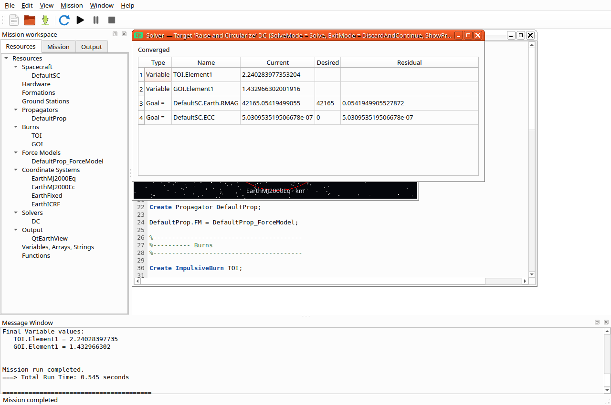
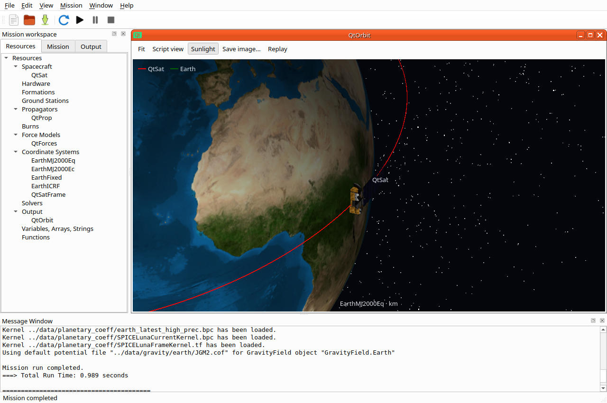

# Qt R2026a parity work — Linux milestones

This records incremental work toward priorities 1–5. It is not a full parity
or goal-completion claim. Windows/macOS packaging remains deferred.

## Resource milestone

Array creation (bounded dimensions in the dialog), array/vector/matrix cell
editing, supported hardware/force-body lists, tank-name-preserving mixture
ratios, and resource sections are implemented. The real-engine workflow test
checks dimensions, finite-number validation, Cancel, pending values, invalid
references, serialization/reinterpretation, zero assignments and undo.
Full specialized force-model/attitude forms and other compound settings remain.

## Commands and solver feedback

Source-preserving forms cover common Maneuver, finite-burn, Vary, Achieve,
Minimize, constraint, Report, FindEvents and solver-branch statements. Tests
exercise reordered options, labels/comments, repeated field changes and branch
body preservation. A real DifferentialCorrector fixture changes an Achieve
goal through the form, solves for the expected value, verifies the progress
table and final residual, closes the table, and reruns successfully.
Function forms and broader optimizer/event acceptance remain.

`hohmann-qt.script` copies the shipped `application/samples/Ex_HohmannTransfer.script`
with only its OFI viewer/view definitions replaced by an OrbitView. Spacecraft,
force model, propagation, burns and targeting statements are unchanged. The
original sample fails to build without OFI; this adaptation is not evidence of
transparent OFI compatibility. That is a separate remaining priority.

The adapted mission completed under Xvfb/xcb with software OpenGL. The captured
native window shows convergence with:

- `DefaultSC.Earth.RMAG`: 42165.05419499055 km, goal 42165, residual
  0.0541949905527872 km (tolerance 0.1).
- `DefaultSC.ECC`: 5.030953519506678e-7, goal 0 (tolerance 0.1).
- Burn variables: TOI.Element1 2.240283977353204 and GOI.Element1 1.432966302001916.

`check-qt.txt` records all nine Qt Linux tests passing after this milestone,
including native/HiDPI rendering, files, workflow, mission, plots and launch.

## Still open in the active goal

1. Deeper specialized resource forms and compound-property coverage.
2. Function/optimizer/event workflow coverage and acceptance.
3. Scripted cameras are implemented; continue real-mission acceptance alongside the remaining graphics work.
4. Remaining graphics and solver-iteration plot features.
5. Explicit OFI-script compatibility strategy and plugin capability coverage.

## Scripted camera milestone

Object/vector reference points, viewpoint objects/vectors, target objects/vectors,
scale and signed view-up axes are recorded at publication time. A shared camera
basis serves the native renderer and headless fallback. Tracking continues under
manual orbit/pan/zoom offsets; Script view resets the offsets and Fit frames the
mission. Projection remains orthographic by design. Replay uses retained numeric
camera states, and clearing solver data also clears its camera snapshots.

The real-engine plot tests compare both ends of moving-object camera histories
and independently convert an inertial X up axis into EarthFixed. Native normal
and high-DPI checks cover target centering, reversed up axes, scale, manual zoom
and exact replay restoration. `tracking.script` supplies a real Aura-model
camera centered on a propagated spacecraft in EarthMJ2000Eq (optional Aura
asset required, as in the earlier model validation).

The native mission completed successfully. `check-camera.txt` records all nine
Linux Qt tests passing after the camera changes.
