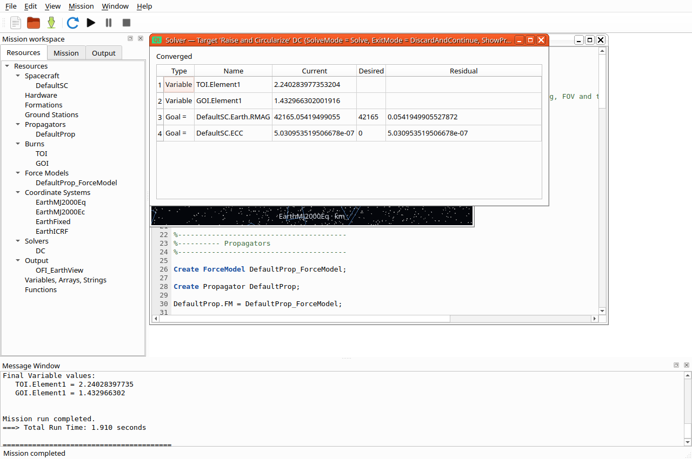

# Qt R2026a parity work — Linux milestones

This records the implementation and Linux acceptance evidence for priorities
1–5. It is not a claim that every wx dialog or optional plugin has identical
coverage. Windows/macOS and clean-machine packaging remain deferred.

## Resource milestone

Array creation (bounded dimensions in the dialog), array/vector/matrix cell
editing, supported hardware/force-body lists, tank-name-preserving mixture
ratios, and resource sections are implemented. The real-engine workflow test
checks dimensions, finite-number validation, Cancel, pending values, invalid
references, serialization/reinterpretation, zero assignments and undo.
Force-model sections also expose owned gravity, drag and radiation-pressure
settings through their canonical engine property names. Tests change gravity
degree/order, propagate, and undo. Spacecraft attitude fields follow the current
representation; changing representations refreshes the editable field set.

## Commands and solver feedback

Source-preserving forms cover common Maneuver, finite-burn, Vary, Achieve,
Minimize, constraint, Report, FindEvents and solver-branch statements. Tests
exercise reordered options, labels/comments, repeated field changes and branch
body preservation. A real DifferentialCorrector fixture changes an Achieve
goal through the form, solves for the expected value, verifies the progress
table and final residual, closes the table, and reruns successfully.
Function-call forms edit inputs and outputs without replacing surrounding
source. The compatibility suite runs a changed GMAT-function cross product,
the shipped Yukon algebraic optimization (X1 and X2 both approach 2), and an
automatic eclipse search. Event settings are editable and reports appear in
Output, alongside solver reports.

`hohmann-qt.script` copies the shipped `application/samples/Ex_HohmannTransfer.script`
with only its OFI viewer/view definitions replaced by an OrbitView. Spacecraft,
force model, propagation, burns and targeting statements are unchanged. The
original sample fails to build without OFI; this adaptation is not evidence of
transparent OFI compatibility. The explicit conversion workflow below now
runs the original sample without this manual adaptation.

The adapted mission completed under Xvfb/xcb with software OpenGL. The captured
native window shows convergence with:

- `DefaultSC.Earth.RMAG`: 42165.05419499055 km, goal 42165, residual
  0.0541949905527872 km (tolerance 0.1).
- `DefaultSC.ECC`: 5.030953519506678e-7, goal 0 (tolerance 0.1).
- Burn variables: TOI.Element1 2.240283977353204 and GOI.Element1 1.432966302001916.

`check-qt.txt` records all nine Qt Linux tests passing after this milestone,
including native/HiDPI rendering, files, workflow, mission, plots and launch.

## Scripted camera milestone

Object/vector reference points, viewpoint objects/vectors, target objects/vectors,
scale and signed view-up axes are recorded at publication time. A shared camera
basis serves the native renderer and headless fallback. Tracking continues under
manual orbit/pan/zoom offsets; Script view resets the offsets and Fit frames the
mission. Projection remains orthographic by design. Replay uses retained numeric
camera states, and clearing solver data also clears its camera snapshots.

The real-engine plot tests compare both ends of moving-object camera histories
and independently convert an inertial X up axis into EarthFixed. Native normal
and high-DPI checks cover target centering, reversed up axes, scale, manual zoom
and exact replay restoration. `tracking.script` supplies a real Aura-model
camera centered on a propagated spacecraft in EarthMJ2000Eq (optional Aura
asset required, as in the earlier model validation).

The native mission completed successfully. `check-camera.txt` records all nine
Linux Qt tests passing after the camera changes.

## Drawing and chart milestone

Native constellation outlines, XY/ecliptic reference grids, wireframe, Sun
direction lines and non-spherical body meshes are implemented. Native tests
check catalog units/ranges, forward/rear hemisphere behavior, pan/zoom
invariance, guide toggles, wireframe restoration, unexaggerated celestial mesh
dimensions and missing-mesh sphere fallback. The real-engine plot fixture
verifies scripted drawing flags and reads the bundled constellation catalog.

Ground-track footprints follow wx's five-degree reference-circle convention;
polar geometry and the dateline are checked. They do not claim sensor or
horizon coverage. XY markers and line styles have distinct image checks, and
indexed highlights leave unrelated samples unchanged. Repeated current-iteration
clearing is tested against a retained break anchor; the previous implementation
discarded that anchor after the first clear.

## Script and plugin compatibility

**Edit > Convert OpenFrames views for Qt**, or the `--convert-views` launch
option, explicitly converts supported `OpenFramesInterface` / `OpenFramesView`
definitions into Qt OrbitView settings. It preserves mission calculations,
validates the resulting script with the engine, and makes one undoable unsaved
edit. The source file is untouched until Save. Per-object labels/grids collapse
to plot-wide controls; the first selected view is imported. Perspective/FOV,
multiple-view switching, trajectory-relative orientation and body-relative
camera rotation are not equivalent. The converted script and message window
list these differences and every dropped viewer property. Unsupported object
kinds and dynamic viewer statements require manual conversion.

The original shipped Hohmann sample completed with `--convert-views` and the
same convergence values as the manual adaptation above. The workflow test
also checks that the mission-sequence text is unchanged and Undo restores the
original. `ofi-import.png` records the native completed mission.

**Help > Available engine types…** shows actual registered types from the
running engine. Registration means a type is available to scripts; it does not
promise a dedicated Qt panel or numerical validation of every optional plugin.
wx-only OpenFrames/OVtoOFI startup plugins are rejected with a clear diagnostic.
Qt startup preserves the available native engine plugins, including functions,
Yukon, event location, propagation, estimation and Python components.

| Area | Acceptance evidence |
| --- | --- |
| Resources and compound values | Workflow: numeric grids, hardware references, mixture ratios, owned gravity settings, attitude representation/state, validation, serialization and undo |
| Commands and solvers | Mission: source-preserving forms and actual DC convergence; Compatibility: changed function arguments, Yukon optimum and eclipse report |
| Scripted cameras | Plots: independent frame conversions; NativeOrbit at normal/HiDPI: tracking, up, scale, manual offsets and replay |
| Visualization | NativeOrbit: constellations, grids, wireframe, Sun line and physical body meshes; Plots: ground footprints, XY styles and repeated solver clears |
| Plugin / OFI workflow | Compatibility: real native-plugin calculations; Workflow: explicit conversion, preserved mission text, real shipped Hohmann and undo; native imported Hohmann screenshot |

`check-final.txt` contains the complete ten-test Linux Qt acceptance run.
Native graphics use Xvfb/xcb and software Mesa; headless tests exercise the
separate fallback paths. This does not establish hardware-driver coverage.

Retained design limits: orthographic Qt controls, five-degree wx-style ground
reference footprints (not sensor coverage), constellation outlines without
names/borders, and diffuse lighting without eclipse shadows. Advanced plugin
fields without a Qt control remain accessible in the script editor. Optional
plugins outside the exercised function/optimizer/event paths require their
own scientific acceptance tests before claiming numerical parity.

## Desktop GPU regression

On 2026-09-29, the default mission reproduced Intel Iris Xe (ADL GT2) GPU
hangs/context resets on GNOME Wayland with four-sample widget MSAA. The mission
contained 123 samples, but capture contained no Earth or trajectory pixels and
the test stalled before failing: [before log](desktop-msaa-before.txt).

Using a single-sample framebuffer with hardware acceleration retained, three
consecutive desktop runs passed in 2.7–2.9 seconds, including title-bar minimize,
Output activation, Earth/orbit pixel checks, restore and repeat minimize.
There were no kernel log entries during those runs: [after log](desktop-msaa-after.txt).
The [captured OrbitView](desktop-orbit.png) shows the texture, trajectory,
spacecraft and stars. The rebuilt application and tests use the same renderer;
[all 11 regression tests passed](check-msaa.txt). This covers the observed Intel
configuration, not every hardware/driver combination. The pixel check is now
part of `QtGui.NativeWindows` so a visible but empty view cannot pass it.

## Automatic OpenFrames conversion prompt

The workflow test loads the shipped `Ex_HohmannTransfer.script`, declines the
conversion offer and verifies unchanged editor text, then accepts and runs the
converted mission. It undoes the conversion and verifies that Run offers it
again. It also verifies that the source file remains unchanged, unsupported
OpenFrames declarations receive a manual-conversion explanation, and ordinary
scripts build normally. [All 11 tests passed](check-ofi-prompt.txt); the Linux
`application/bin/GmatQt` executable was rebuilt with this behavior.

## GPS filter/smoother and warm starts

KalmanTests qualifies a one-hour noise-free version of the shipped GPS
filter/smoother example with SNC process noise and Gauss-Markov drag estimation.
GUI settings match independently scripted state reports and the complete
warm-start CSV. It exercises typed references/run commands, owned model settings,
file picker Cancel, paired date conversion, both warm-start continuation
boundaries, exact Undo/Redo/Unicode mission reopen, report viewers, rejected
settings and missing/malformed/late-seed recovery. Labeled smoother serialization
and SNC vector-setter fall-through bugs were fixed; calculation algorithms remain
unchanged. The earlier command-edit failure is retained in
[the diagnostic log](kalman-command-before-fix.txt).

[Native Wayland passed](kalman-wayland.txt). Exposed captures show the
[warm-start controls](kalman-wayland.warm.png),
[SNC settings](kalman-wayland.snc.png) and
[Gauss-Markov settings](kalman-wayland.fogm.png).
[All 30 Qt suites passed](check-kalman.txt) in 153.67 seconds with the user's
GmatQt executable rebuilt. Full-day/noisy/real observations, additional models,
creation/removal, covariance/residual graphics/prediction, warm-start smoothing,
broader malformed/relative files and disk failures remain unqualified.

## Script previews and run summaries

InspectionTests exercises applied resource/command script previews through their
actual MDI panels, preserving pending edits and the script undo history. Command
and entire-mission summaries use captured engine states, typed coordinate-system
selection and all/physics filtering. Separately reported first/second coast
states agree with summaries in Earth inertial, Earth fixed, Moon inertial and
barycenter frames. Script-event matching-end/name restoration, skipped branches,
stale rebuild/source protection, failed/stopped recovery, read-only Find/Copy,
Unicode export, chooser acceptance/Cancel, write-error retry and source-symlink
protection are covered. Generic command text Apply is qualified with a ClearPlot
missing-reference failure and correction to MarkPoint, followed by save/reopen
and unchanged state reports.

[Native Wayland passed](inspection-wayland.txt); the
[summary layout](inspection-wayland.png) was inspected. All 31 registered suites
passed across the headless/native runs: [the initial full invocation](check-inspections.txt)
passed 26 headless checks but could not connect five X11 tests to their temporary
display inside the sandbox; [all five reruns](check-inspections-native.txt)
passed with display access in 37.75 seconds. Portal choosers,
Wayland top-level minimize/restore, font zoom and broader summary/solver-loop
semantics remain unqualified. The source audit is now 32 of 108 Pending audit;
this checkpoint does not complete the broader replacement goal.

## Variable/String values and direct Array cells

Parameters tests qualify focused scalar Initial value panels and typed initial
values in New resource. Actual MDI/dialog paths cover pending previews,
Cancel, invalid correction, interpreted-value rollback, exact source Undo/Redo,
Unicode save/reopen and independently scripted numeric/text report agreement.
Grouped/default initializers, optional semicolons and implicit mission boundaries
retain subsequent executable assignments. The existing engine parser's String
truncation cases are rejected; supported apostrophes, percent, spaces and
statement-looking literal data retain their exact values.

Actual New resource creates a 1000×1000 Array. Row/Column selectors navigate to
its final cell, invalid Set is rejected, Cancel leaves the engine unchanged,
and pending grid acceptance/Apply/save/reopen retains its value. Column widths
remain adjustable. Added resources can be deleted without changing the original
report outputs.

[Native Wayland passed](parameters-wayland.txt); inspected captures show
[Variable values](parameters-wayland.variable.png),
[String values](parameters-wayland.string.png),
[maximum Array creation](parameters-wayland.create.png) and
[direct last-cell editing](parameters-wayland.array.png).
Desktop portal choosers, broader keyboard/focus and shared Help remain
unqualified. The source inventory now has 30 of 108 Pending audit entries;
audited rows and selected plugins still have incomplete acceptance cases.

[All 32 Qt suites passed](check-parameters.txt) in 172.91 seconds, including
native viewer and launch checks, with the user’s application/bin/GmatQt rebuilt.

## Startup-path workflow

PathTests drives Set paths Add/Replace/Remove/Up/Down and directory browsing,
Cancel/Apply and invalid recovery. Identically named functions in two search
directories produce the expected 10/15 as GUI priority changes, matching a
separately scripted explicit FunctionPath. Default report/log output moves to a
Unicode directory; explicit report destinations retain their paths, and the
Output report viewer shows the relocated file.

Malformed, missing-root and wx-only startup imports preserve the session. Exact
rollback covers file aliases, Python order, startup identity, runtime modes and
existing logs. Unicode export/read/Cancel/Apply, mission/symlink protection,
write-error retry, a separately launched GmatQt using the saved startup and
run/Stop guards are covered. Optional wx help entries no longer break export;
relative startup paths now resolve from the executable for fresh launches from
files saved elsewhere. Pre-fix diagnostics are retained for
[startup export](paths-export-before-fix.txt) and
[fresh reload](paths-relaunch-before-fix.txt).

[Native Wayland passed](paths-wayland.txt); inspected captures show
[ordered function paths](paths-wayland.functions.png),
[output selection](paths-wayland.output.png) and
[pending startup preview](paths-wayland.startup.png).
Portal choosers, MATLAB editing, wider startup/storage formats and cached
plugin/data hot replacement remain unqualified. The wx inventory now has 27 of
108 Pending audit entries; the broader goal is still active.

[All 33 Qt suites passed](check-paths.txt) in 135.35 seconds, with native
viewer/launch checks and the user’s application/bin/GmatQt rebuilt.

## Solar-system source and file workflow

SolarSystemTests configures DE405, DE421, DE424 and SPICE through the actual
resource panel, including paired Unicode file selections, UseTT and update
interval. Its reports match separately scripted configurations through the
same engine; frame-origin offsets also match body ephemeris values. Pending
changes, source-dependent controls, picker/close Cancel/Discard, invalid file
and interval rollback/correction, stale panels, exact Undo/Redo and Unicode
save/reopen are exercised. A retained custom DE fallback survives subsequent
spacecraft, create/delete and mission edits under SPICE. Running/Stop guards
and recovery are covered.

[Native Wayland passed](solar-wayland.txt), with inspected
[DE controls](solar-wayland.de.png) and [SPICE controls](solar-wayland.spice.png).
Qt file dialogs were used; native portal selection, broader epoch/cache regimes
and malformed complete DE content remain unqualified. The inventory now has
26 of 108 Pending audit entries; the broader replacement goal remains active.

[All 34 Qt suites passed](check-solar.txt) in 143.78 seconds, including
native viewer and launch checks, with application/bin/GmatQt rebuilt.

## Celestial-body editor and rendered appearance

`CelestialBodyTests` qualifies the dedicated four-page MDI editor against wx
field/enabling rules and runtime setters. Earth physical settings and user
Asteroid Ceres ephemeris/pole/SPICE-frame reports match separately configured
scripts. PCK/FK/SPK controls cover chooser Cancel/accept, replacement, removal,
order, invalid-type rollback, startup default clearing and Unicode save/reopen.
Unknown NAIF ID and missing SPK recover after correction. Pending edits,
Close Cancel, exact Undo/Redo, repeated comment-preserving 3DModel settings,
model/texture clearing, invalid appearance and Run/Stop guards are covered.

Native Wayland captures were inspected:
`bodies-wayland.{properties,orbit,orientation,visualization}.png` and
`bodies-wayland.{texture,model}.png`. A checker texture and posed OBJ alter more
than 2,000 rendered pixels while mission reports remain identical. Long rows
wrap to fit desktop scaling. The raw native log `bodies-wayland.txt` includes
SPICE FILEOPENFAILED/IOSTAT 128 diagnostic-file warnings from negative execution
cases; recovery passes, but error-file diagnostics remain unqualified.

All 35 Qt suites passed in 144.97 seconds after rebuilding the user's GmatQt;
combined evidence is `check-bodies.txt`. Broader bodies/epochs/frames/coverage,
relative kernel paths, formats/materials, multi-panel/keyboard/focus behavior,
portal choosers, shared Help and top-level Wayland main-window minimize/restore
remain unqualified. The wx inventory has 21 of 108 Pending audit entries;
audited partial rows and plugin/file gates remain open, and the overall
replacement objective is unfinished.

## Shared body selection and preserved implicit defaults

The additional `CelestialBodyTests` cases drive both wx body-selector callers:
solar-power shadows and force-model primary/point masses. Configured Ceres is
included; Sun is excluded from shadows, and gravity lists exclude the opposite
pending selection. Select all/Clear/Cancel/pending/Apply, typed invalid/overlap
rejection, exact Undo/Redo and Unicode save/reopen are covered. Exact power and
propagation reports agree with separately written scripts. Empty shadow lists
clear prior explicit membership and suppress the default Earth through
save/reopen/run; empty point-mass selection also executes.

`body-selection-wayland.{shadow-selection,point-selection}.png` were visually
inspected after the native run; output is `body-selection-wayland.txt`.
Body-list-only edits now preserve surrounding source and implicit defaults.
The test found that whole-mission serialization can make a power system's
implicit epoch explicit and slightly change its decay result. Broader combined
scalar/list/default/epoch cases still require qualification. The interpreter's
empty solar-shadow list now invokes the existing clear action/no-bodies flag;
no numerical algorithm was changed.

The full regression log is `check-body-selection.txt`. The existing SPICE error-
file diagnostic warnings remain in negative execution tests. Optional calculated-
point mode, broader gravity/owned-component transitions, multiple pending
panels, portal/keyboard/focus, shared Help and top-level Wayland minimize/restore
remain unqualified. The wx inventory now has 20 of 108 Pending audit rows and
audited partial rows and plugin/file gates remain open.

The final rebuilt GmatQt passed all 35 Qt suites in 146.68 seconds; the separate
Wayland body/selection workflow passed as well.

## Source-preserving resource edits and mixed implicit defaults

`ResourceRoundTripTests` exercises actual MDI resource panels rather than only
calling serializers. A spacecraft Cd edit preserves Keplerian input values,
comments, a power system's implicit initial epoch and an unused Asteroid's
implicit physical defaults. Its complete numerical report stays exactly equal
to the original run. Mixed solar-power scalar/shadow-list edits, explicit empty
shadows after prior membership, invalid-edit correction and save/reopen agree
exactly with independently written scripts. The same mixed edit preserves an
implicit mission boundary and its original command suffix.

The new patcher compares matching old/new resource snapshots and rewrites only
changed configuration assignments. It handles dotted owned settings, repeated
left-hand sides, continuations, grouped Array declarations and indexed numeric
cells. Resizing one of two Arrays preserves the other declaration, values and
comments, with reports equal to a separately resized script. Exact Undo/Redo
and Unicode save/reopen are covered. Removed owned coordinate-axis settings
are checked separately, and resource type replacement is rejected.

Force-model selectors create their dependent forces. Patching just a selector
can leave an unchanged subfield before its creator; legacy unqualified aliases
can also survive under the wrong body/model. Owned force edits therefore replace
that edited model's configuration as an ordered unit, including raw aliases,
while retaining other resources and the complete mission source. Atmosphere,
external-force and polyhedron suites cover model/body changes and numerical
report agreement. Optional FOV placeholders are omitted from both snapshots,
so selecting a real FOV named `UndefinedFieldOfView` is retained correctly;
the estimation suite covers selection, replacement and clearing.

The native Wayland resource workflow passed; its power panel was visually
inspected in `round-trip-wayland.power.png`, with raw output in
`round-trip-wayland.txt`. This extends mixed scalar/list/default qualification;
wider alias/dependency combinations, resource deletion, filesystem/portal
failures and remaining inventory gates still require qualification. No numerical
algorithm was changed.

The rebuilt GmatQt passed all 36 suites across the full 31-suite non-native run
and the five native suites rerun with desktop access. The initial sandbox run
could not reach its temporary X display; that failure and the successful native
rerun are preserved in `check-resource-round-trips.txt` and
`check-resource-round-trips-native.txt`. The separate Wayland workflow also
passed. The source inventory remains 20 of 108 Pending audit entries; this
checkpoint does not close the broader replacement goal.

## Source-preserving resource deletion

Resource deletion now removes only the selected declaration and configuration
assignments from the original source. Grouped Create declarations retain their
other Variables/Arrays, and inline/continued comments remain in place. The
mission suffix and implicit power epoch remain unchanged. A missing source
declaration is rejected with an instruction to edit its defining file; the
engine still rejects resources referenced by other objects or mission commands.

`ResourceRoundTripTests` covers exact create/delete/Undo/Redo of a numeric
Variable, creation/deletion of DifferentialCorrector and Yukon resources,
grouped Variable/Array deletion with retained other initializers/comments,
Unicode save/reopen and unchanged independent power/state/array reports.
WorkflowTests continues to exercise pending-panel/stale/reference guards and
the actual confirmation/context-menu deletion path; estimation and parameter
suites cover plugin resources and initialized numbers/strings.

The source audit of wx ResourceTree confirms that bodies/SolarSystem have Open
and Close without a Delete action. They are SolarSystem-owned and cannot be
removed through ConfigManager's generic deletion API. Qt disables that action
and returns an accurate explanation for direct calls, including a configured
user Asteroid; source/model/report retention is tested. Script deletion of a
user-defined body remains a separate text workflow. The first-character
resource declaration case exposed Qt's negative-index lastIndexOf behavior;
configuration removal now uses an explicit beginning-of-file boundary.

The dedicated Wayland create/delete/round-trip run passed; raw output is
`round-trip-deletion-wayland.txt`. Wider include-file, alias and storage-failure
cases, shared Help/keyboard/portal interactions and the remaining qualification
gates remain open. No numerical algorithm was changed.

The rebuilt user's GmatQt passed all 36 suites in 152.07 seconds in one run;
full output is `check-source-deletion.txt`. The separate native Wayland workflow
also passed. This checkpoint preserves the larger goal and its open gates.
