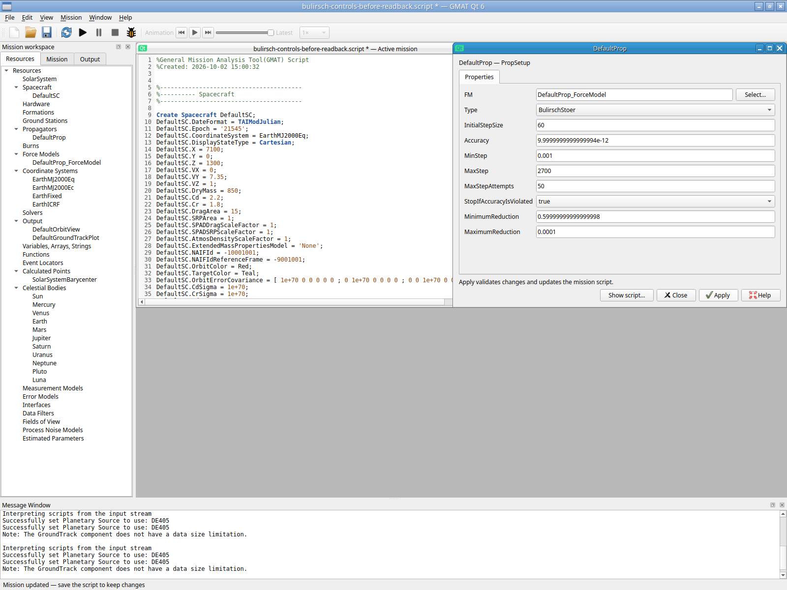
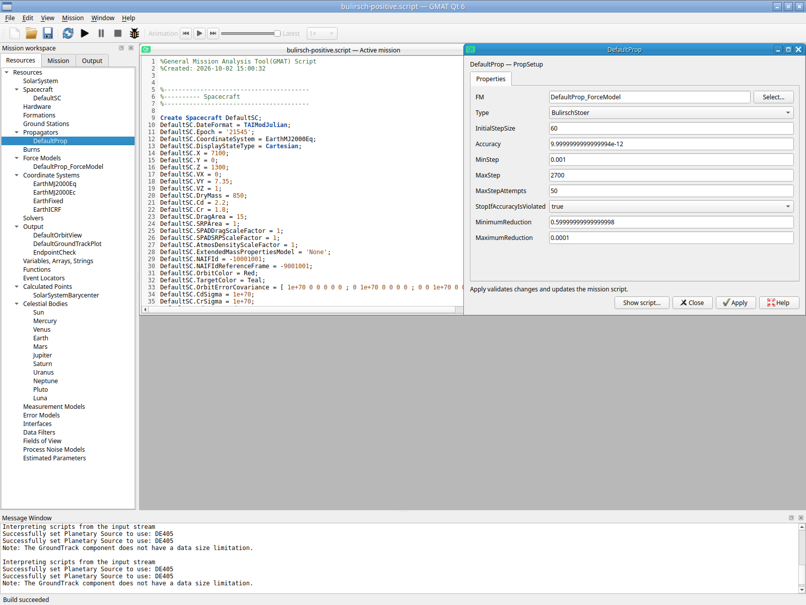
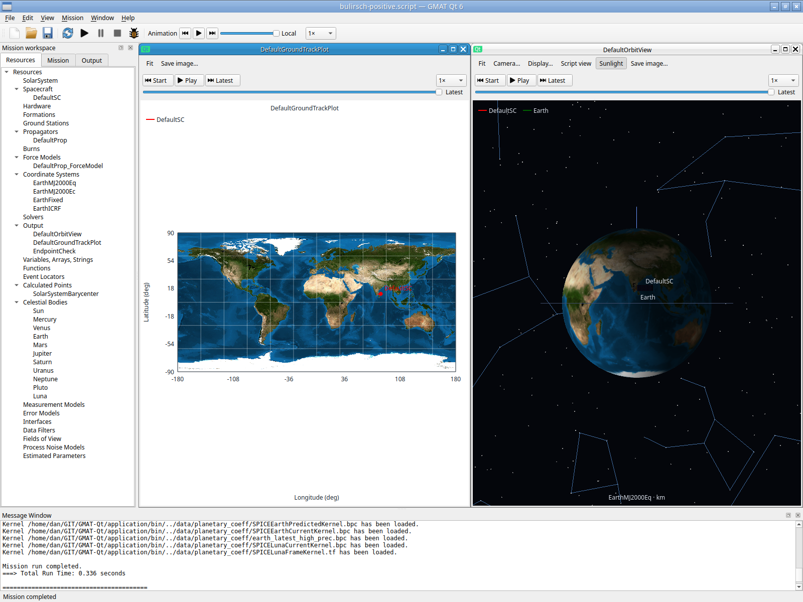
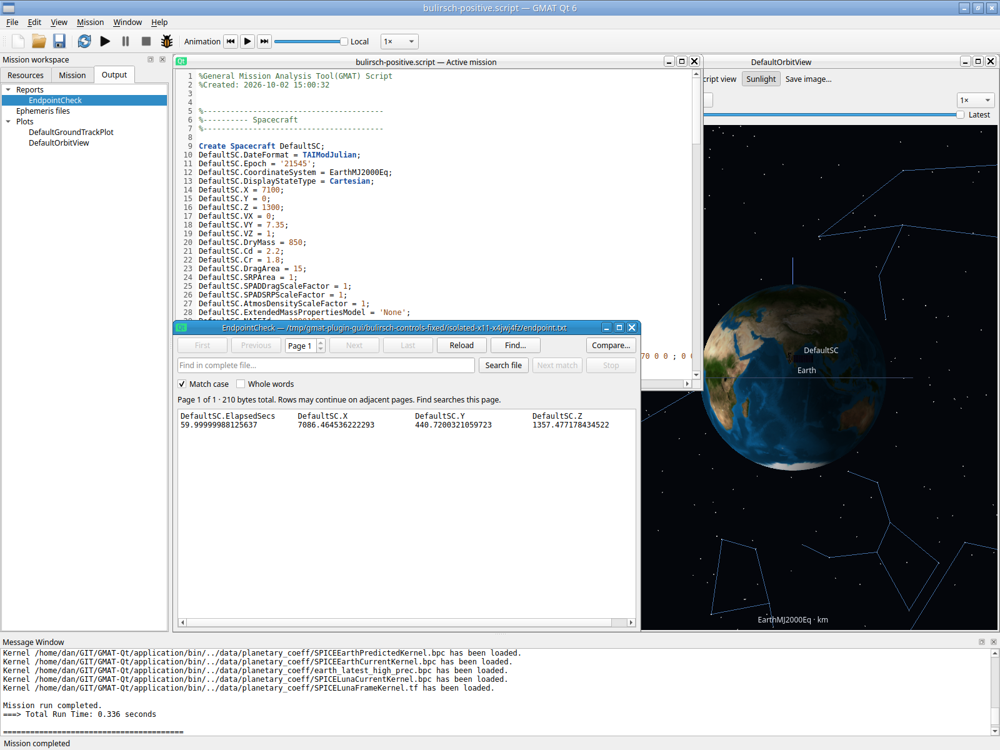

# Bulirsch–Stoer configured reductions — 2026-10-02

The positive custom-control gate passes for the selected Linux Qt runtime. The original actual-input failure is retained; it revealed that the BulirschStoer copy constructor reset `MinimumReduction`/`MaximumReduction` to defaults. Only those two copy initializers now copy the configured values, matching the existing assignment operator. Integrator formulas and numerical algorithms are unchanged.

The first bounded authenticated Xvfb/Openbox/XTest session began with GUI New mission, selected BulirschStoer, and applied `0.6`/`0.0001`. The form retained entered text while serializing `0.7`/`1e-05`. Reopening showed the defaults. A second direct Apply, before any unrelated command edit, reproduced the failure beside unchanged source. No mission was run on that rejected intended configuration. Raw session: `/tmp/gmat-plugin-gui/bulirsch-controls/isolated-x11-3r6tjm60`, including `failed-positive-controls.json`, screenshots005/010/011/012 and saved source SHA6eb4748ffe9462104b2c9bb40d2b8b4ee1da5d4785c806ff5b5c3a6ca13c29b6. Ctrl+Q was not a configured File Exit shortcut; the app remained mapped, and helper cleanup terminated it(-15). That first session is not normal-exit evidence.

One new focused `QtGui.BulirschControls` check passes in0.27s. It covers actual MDI resource-form pending/Apply and explicit source, writable metadata/read-only exclusion, nested PropSetup/direct propagator copies, exact unrelated source, invalid finite-input rollback, Undo/Redo, Unicode save/reopen, and one short endpoint run. Both the Sandbox setup and Propagate command's actual owned runtime clone retain the requested fields.

One actual-input retry resumes only the previously saved owned milestone; no sample/reference is used. Apply now normalizes0.6 and retains0.0001. GUI Save As followed by Ctrl+O and resource-panel reopening retains both. The operator enters an explicit endpoint Report resource/command through actual script-editor keys, saves, and performs exactly one F5 run: Completed0.336s. GUI Output Enter opens the populated report; the Propagate summary is saved through its actual Save As control.

Declared input is BulirschStoer, InitialStepSize60s, Accuracy1e-11, MinStep.001s, MaxStep2700s, MaxStepAttempts50, StopIfAccuracyIsViolated=true; Earth/JGM2 degree/order4 and original spacecraft state(7100,0,1300)km/(0,7.35,1)km/s remain unchanged. The two reduction values and explicit report lines are the only source differences from the failed saved milestone. Own input5410bytes SHA0f588e54af0f6b275a39046b1590edfabc43dedfa54febdac021c11cab5364c8 remains unchanged after reopen/run/exit. The old failed source hash also remains unchanged.

The single report row gives ElapsedSecs59.99999988125637 and EarthMJ2000Eq XYZ(7086.464536222293,440.7200321059723,1357.477178434522)km. The saved GUI summary agrees within its printed precision; maximum Cartesian difference2.205524651799351e-11km. This establishes declared-input retention and consistent endpoint reporting. It adds no independent scientific tolerance/algorithm qualification and does not repeat the earlier analytic circular-orbit matrix.

`MinimumTolerance` is correctly absent: plugin source marks it read-only/deprecated and its setter warns that it has no effect. It is not a positive editing requirement. Help Resource_Propagator lists BulirschStoer as a GUI/script type but does not specify these two custom controls.

Retry runtime identity: appb8074b0222cbd4d3a4c67cacf37262181aeb94d13b3ebd3ed2ea061b8ba8dad5; ExtraPropagators plugin047265890211b5c7a232925338c24cee87d1cef10c37ee6efbac363ae537e35b; basecf147e23.../startup5f80be1f... unchanged. Startup clone changes OUTPUT_PATH only; private display/settings/runtime/no-host-bus/software GL preserve the user's desktop. Actual File→Exit ends application0, followed by WM/Xvfb0. The helper reports1 because its next queued action encounters the already exited application; this is retained as harness disposition, not an app crash. GNOME/Wayland/portals/hardware and broader plugin regimes remain separate acceptance gates.

Raw retry session: `/tmp/gmat-plugin-gui/bulirsch-controls-fixed/isolated-x11-x4jwj4fz`, including actions/session JSON, application log, own script, endpoint.txt, propagate-summary.txt and endpoint-summary-comparison.json. Build/check logs: `build/example-qualification/20261002/bulirsch-controls`. Source change: plugins/ExtraPropagatorsPlugin/src/base/propagator/BulirschStoer.cpp copy constructor; focused regression: src/qtgui/tests/BulirschControlsTests.cpp.

Both complete original session trees are additionally preserved in ignored `build/example-qualification/20261002/bulirsch-controls/original-failure` and `native-retry`; the artifact index hashes all raw session and build/check files. Original `/tmp` trees remain untouched.
