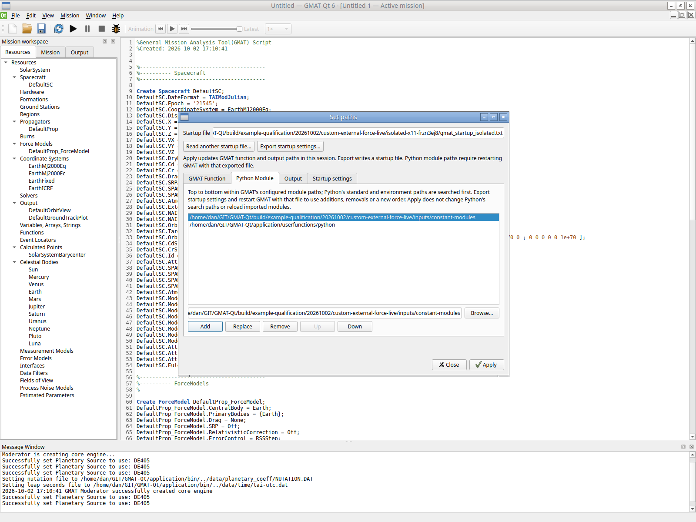
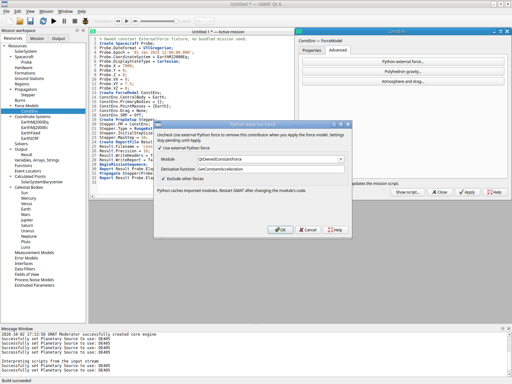
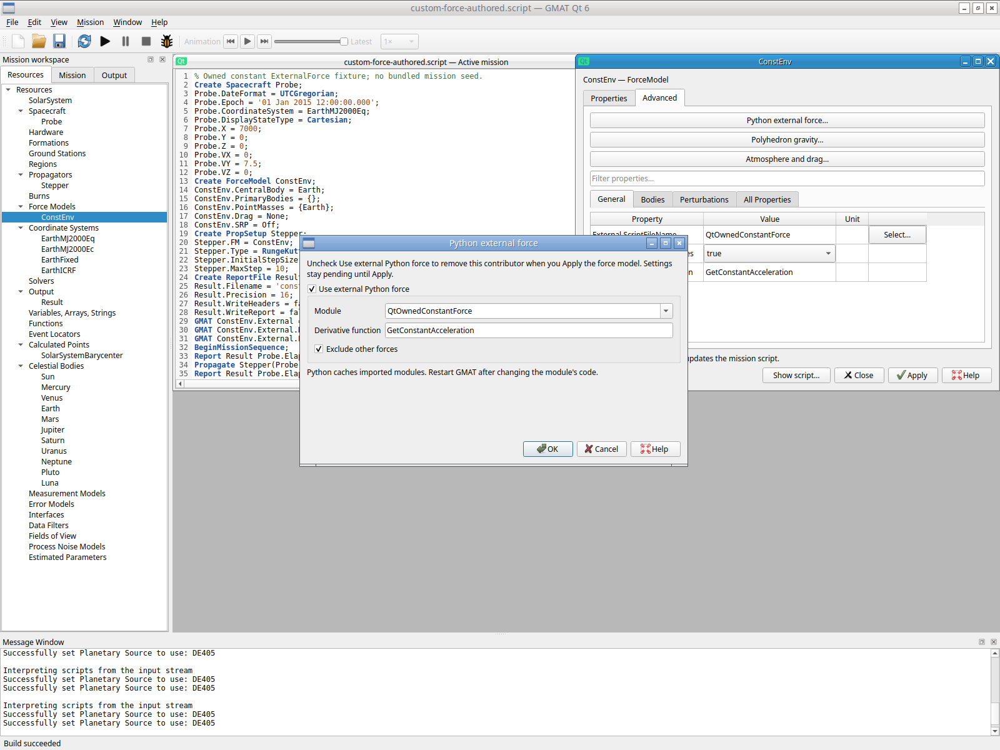
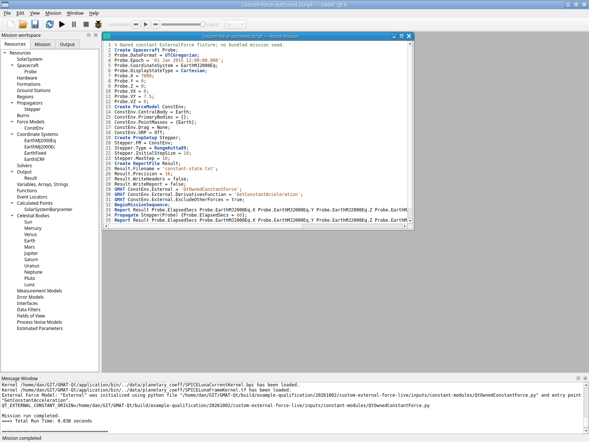
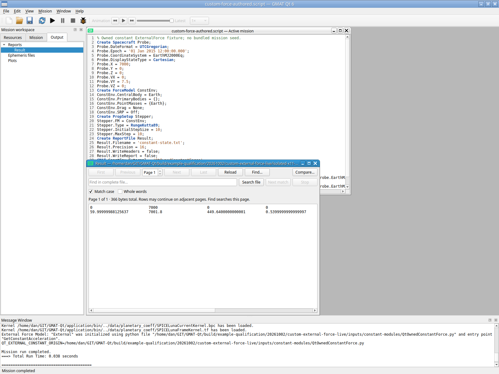

# Custom-path ExternalForce after GUI startup export — 2026-10-02

One ordinary user-provided Python force module outside bundled paths passes actual Set paths export/restart, ExternalForce enable/module/function/exclusion Apply, Save As/Ctrl+O/form readback, and one short private GUI run. No engine change is required. This closes the integration left separate by [ordered Python paths](python-module-paths-20261002.md), reusing its control/recovery coverage without repeating it.

Both sessions use 600 s bounds and six/twelve actual-input batches respectively; final successful input occurs at 112.964/346.289 s, before either deadline. Both authenticated private Xvfb/Openbox sessions start with `script:null`, fixed application `244dc41a…` and fresh settings/runtime/no-host-bus/software GL. The first actual Edit → Set paths → Python Module Add inserts the single owned `inputs/constant-modules` directory. Export startup settings writes the owned full startup; the dialog closes and File → Exit ends the application normally. No Python import or mission run occurs in that process. The fresh second application starts with that GUI-exported file; the helper changes only OUTPUT_PATH to its own output directory.

The second session uses Welcome New mission and actual linewise keyboard input of 32 independently declared spacecraft/force/propagator/report/mission lines, never a copied mission or sample. The built scaffold's initial point-mass model is never run. Resources ConstEnv Enter → Advanced → Python external force enables `QtOwnedConstantForce`, derivative `GetConstantAcceleration`, and Exclude other forces (006). Nested OK and parent Apply insert exactly the three supported External assignments while retaining every scaffold byte (007). GUI Save As, Ctrl+O/Build and reopened dialog readback retain enabled/module/function/exclusion (010). Cancel closes that clean readback; no further changes are applied.

The only copied input is the unchanged [owned Python callback](custom-external-force-callback-20261002.py), outside both bundled module paths and the mission/application directories. It returns six values `[0,0,0,0.001,-0.0002,0.0003]`; ODEModel supplies position derivatives from velocity. It checks one six-state first-order Cartesian propagation and prints its own `__file__` on the first call. The callback uses no API, NumPy, package or data dependency. ExternalModel initializes Python with configured startup paths, resolves/logs its full module path and entry point, then calls the four-argument Python wrapper. Exclude other forces registers the contributor as exclusive through the existing interpreter; no force or propagation algorithm changes.

Declared input is EarthMJ2000Eq position `(7000,0,0)` km and velocity `(0,7.5,0)` km/s at UTC 01 Jan 2015 noon; RK89 InitialStepSize/MaxStep 10 s propagates 60 s. Constant acceleration `(0.001,-0.0002,0.0003)` km/s² gives the closed form `r=r0+v0*t+a*t²/2`, `v=v0+a*t`. Expected at nominal 60 s: position `(7001.8,449.64,0.54)` km, velocity `(0.06,7.488,0.018)` km/s. WriteReport=false suppresses subscriber rows; explicit Report commands write initial and final states only.

Exactly one F5 completes in **0.038 s**. Engine initialization and the callback's first-call print both identify the exact owned `inputs/constant-modules/QtOwnedConstantForce.py`, with entry `GetConstantAcceleration` (011). Actual Output leaf Enter opens the 366-byte two-row report (013). All 14 numbers are finite; initial values exactly match the declaration. Reported final elapsed time is `59.99999988125637` s, differing from nominal 60 s by −1.187436283e−7 s. At that reported time the maximum component error is **8.891523749e−7 km** in position and **1.187436260e−10 km/s** in velocity, within the predeclared 1e−6 km/1e−9 km/s component bounds and 1e−6 s elapsed bound. Comparison to nominal 60 s also remains explicit: largest position discrepancy 1.136868377e−13 km and velocity discrepancy 8.881784197e−16 km/s. This is one independently known polynomial callback/result, not general integrator/scientific accuracy or bitwise identity.

The live Set paths dialog captures `FileManager::WriteStartupFile`'s engine snapshot (PathSettings.cpp:113–119), so this export normalizes the original generated startup's comments/format. All 21 ordered plugin values and the first isolated output survive; Python paths name the owned directory then the installed directory. This is no claim of comment-byte preservation for that normalized snapshot, live module reload or changing Python's current search path. The first read-only verifier compared raw paths without terminal slashes and raised AssertionError; canonical physical-directory comparison corrected the verifier, with no application failure, source change or repeated mission. Exact original and exported startup files and this disposition remain preserved.

Saved own source is 1344 bytes, SHA `8318112ebcd417731a67ee964fa06829c1920c2c8677bdd09ebcb17e9580051d`, unchanged after reopening/execution. The callback is 591 bytes, SHA `b7f9386c4031a2e5c743ce3af2e7959c867ba2b0ea1b3352f247807c74b8b409`; exported startup 10,184 bytes, SHA `6b83f495e344c6045dcfecb7179b9dc5209485e043836cca06ced274a3b25292`; report SHA `4ba65842a68af7e13ae9cb272a679247f98efa5b5c89e42b372c5628b4ce3619`. The unchanged [authored source](custom-external-force-authored-20261002.script), [exported startup](custom-external-force-startup-20261002.txt), [report](custom-external-force-report-20261002.txt) and [verification JSON](custom-external-force-verification-20261002.json) preserve the declared inputs, full numeric errors and boundaries. The exported startup retains its owned output path; it is historical input evidence, not a portable default startup.

Both actual File → Exit operations yield application/WM/Xvfb **0/0/0**, with all six recorded owned PIDs absent. Each helper exits 1 only when its next queued wait recognizes the already normally exited application; neither application is forced, crashed or timed out. Raw evidence under `build/example-qualification/20261002/custom-external-force-live` preserves both sessions `isolated-x11-frzn3ej8`/`isolated-x11-boo99f4d`, all 21 PNGs/actions/logs, input/export/report and original startup clones. `artifact-index.json` indexes the original retained bytes; metadata records the verifier correction.

Compiled source `2f9810c0`, application `244dc41a2402dbf7b7235027c02b840f0319b77bafd4798bf23617a9645c11f0`/5,926,536 bytes, base `cf147e23…`, util `1e4e7fe6…` and production startup `5f80be1f…` stay fixed for this historical case. No path-order/error matrix, tutorial, corpus, old test, package/cache/API or numerical-engine work is repeated. Host GNOME/Wayland/portal/physical-GPU/crash and full replacement acceptance remain separate; Windows/macOS/MATLAB are deferred.

