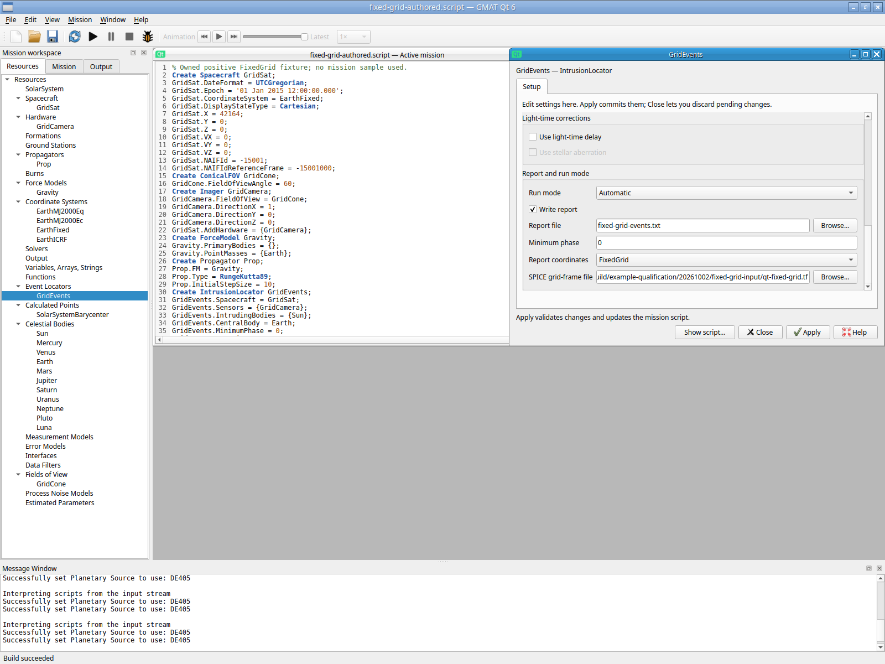
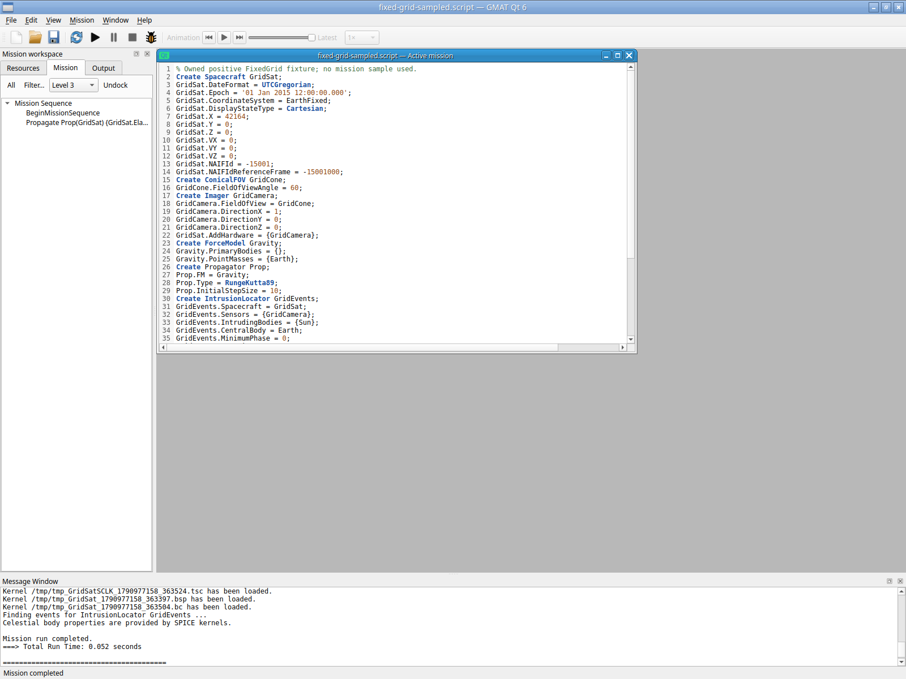
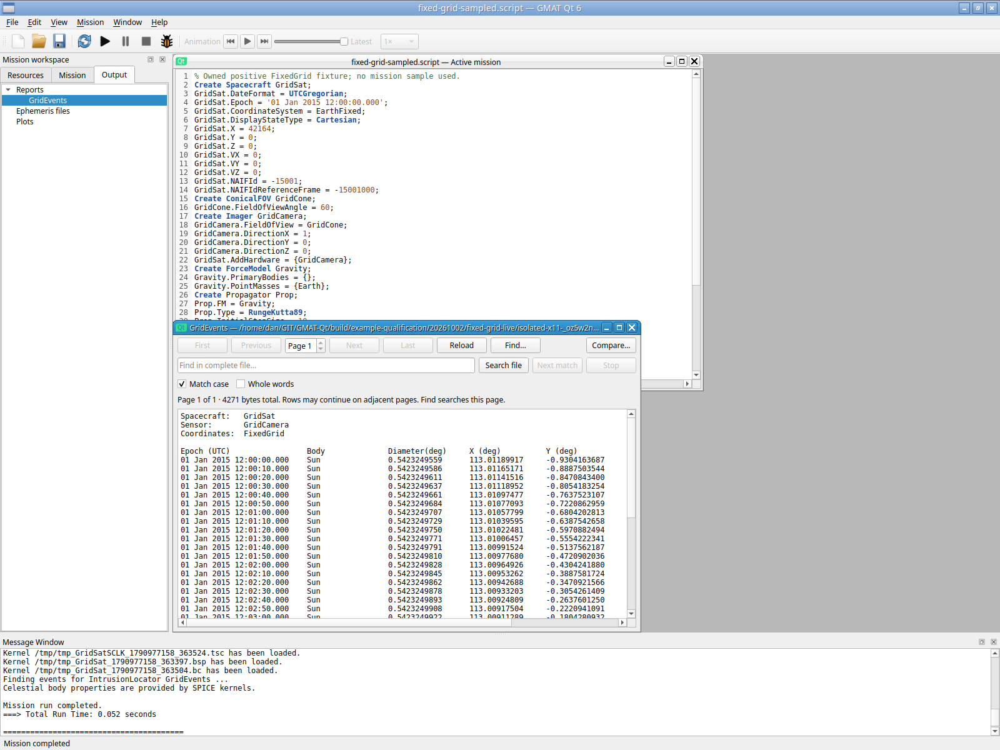
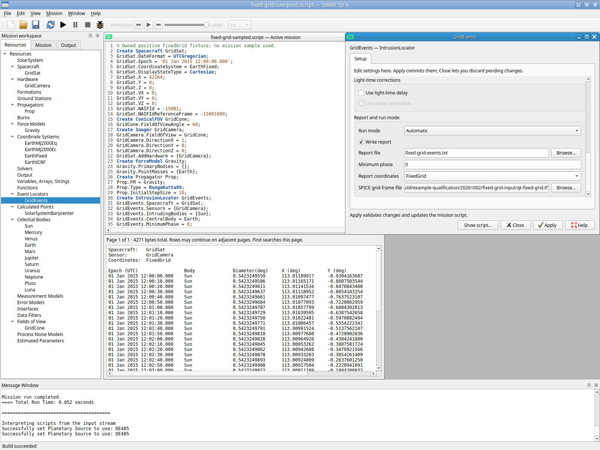

# Positive FixedGrid intrusion report — 2026-10-02

The selected EventLocator FixedGrid gate passes for one owned, bounded private X11 configuration. No production or numerical algorithm change was needed. The first inadequate ephemeris fixture is retained as unqualified; one corrected fixture run supplies a nondegenerate 2015 coverage interval and a populated FixedGrid report.

The authenticated Xvfb/Openbox/XTest session starts with GUI New mission (`script:null`). Forty-five independently declared resource/mission lines are entered into the actual Script editor, then built. No shipped mission/reference, Qt model setter or engine API constructs the mission. The actual GridEvents resource form changes Report coordinates from SensorFrame to FixedGrid, enables the file control, selects the owned readable frame file via Browse, and Applies. GUI Save As/CtrlO and form reopening retain FixedGrid and the frame path. This qualifies the practical selector/file/Apply workflow; it does not claim that every resource in this fixture was constructed through its dedicated form.

The owned [frame file](fixed-grid-frame-20261002.tf) is a single class4 identity frame relative to IAU_EARTH. Its Earth center and explicit GRID_ORIGIN_FRAME/CENTER/IDCODE/XYZ match the current GMAT loader. The format uses the primary [NAIF frame specification](https://naif.jpl.nasa.gov/pub/naif/toolkit_docs/C/req/frames.html); GMAT-specific grid keys come from IntrusionLocator.cpp1554–1642/2020–2140. It requires selected-runtime Earth/Sun ephemeris/orientation kernels, not a downloaded spacecraft kernel. The Help's illustrative `../data/hardware/FixedGridFile.tf` is absent from this distribution; the owned file supplies the missing input for this gate. It is a qualification fixture, not an added scientific mission or a broad parser repair.

Declared input is spacecraft GridSat at UTC 01 Jan 2015 12:00:00.000, EarthFixed Cartesian(42164,0,0)km and(0,0,0)km/s, point-mass Earth; RungeKutta89, InitialStepSize 10 s, then MaxStep 10 s. GridCamera points along +X with a 60-degree conical field; the only intruder is Sun. Locator StepSize 10 s, MinimumPhase 0, Automatic, WriteReport=true, UseEntireInterval=true, light-time/stellar-aberration corrections off. The frame origin is explicitly Earth-fixed(42164,0,0)km. EphemManager.cpp1113–1128/1467 still uses the spacecraft as SPICE observer; the frame origin is not a replacement event observer.

The first 60-s run completes in 0.021 s but warns `Insufficient ephemeris data available ... Event location may be incomplete`. Its report contains zero events and a degenerate default2000 interval. This is not positive execution evidence. `first-incomplete-coverage/` preserves that original script/report/log/status and screenshot009. The corrected source differs only by actual GUI Prop.MaxStep 10 and Propagate duration 300. It retains the explicit 2015 epoch and UseEntireInterval; no backend code, equations, state, cone or frame changed. Bounding the step provides enough ephemeris samples for the SPK writer.

Exactly one corrected F5 run completes in 0.052 s. The report contains one continuous Sun intrusion, Start 01 Jan 2015 12:00:00.000 through End12:05:00.000, with 31 finite entries at10-s intervals. The printed `Number of individual events: 31` counts report entries; `Number of total events: 1` is the continuous event. FixedGrid X/Y are the existing report convention, not an asserted cone-angle identity or independent astrometric tolerance. Actual Output-tree Enter opens the populated report (015). GUI CtrlO builds the saved own source; GridEvents readback retains FixedGrid and its readable frame path (018). The report result is reconciled to the declared time interval and sampling; no independent scientific/mission validation is claimed.

Source SHAaf8ac7e9fd42e455e8bf140696193f3c7c2aa83a590ff57099f93b103bfb45bd; report SHA58c3b89066114dfb5cc70334712f2c7e56d27f29b02a25ec4369d44d5f638952; frame SHAe20cb37e6b04098c8de8ec39726f94f3acf373e2757f581629858620265607a7. The original inadequate source stays SHA c67929e0697ecf7495d0b6eaa5276e95eb30875c38b47c1c4a91fae438e8638a. Byte comparison proves only the two justified sampling/duration differences. [Machine-readable verification](fixed-grid-verification-20261002.json) records these checks. The [authored script](fixed-grid-authored-20261002.script) retains its actual absolute build-artifact frame path; copying the frame to another path requires an explicit corresponding path edit.

Raw evidence: `build/example-qualification/20261002/fixed-grid-live/isolated-x11-_oz5w2n3`, including actions/session JSON, application log, first-incomplete-coverage, saved own sources, output/fixed-grid-events.txt and unchanged screenshots. Appb8074b0222cbd4d3a4c67cacf37262181aeb94d13b3ebd3ed2ea061b8ba8dad5; controlled core/startup unchanged (startup5f80be1f...). The private startup clone changes OUTPUT_PATH only; owned authenticated display/settings/runtime/no-host-bus/software GL leave the user's desktop untouched. Actual File→Exit yields app 0/WM 0/Xvfb 0. Helper exit 1 is its next-action detection of the already normally exited application, not an app crash. This adds no GNOME/Wayland/portal/hardware-driver or full replacement qualification; region/spacecraft-observer contacts, additional FOV/report formats, coverage boundaries and disk-write failures remain separate gates.

