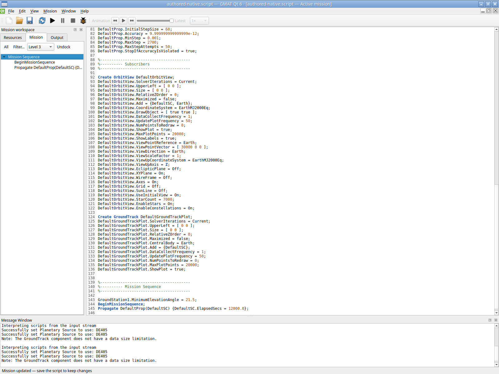
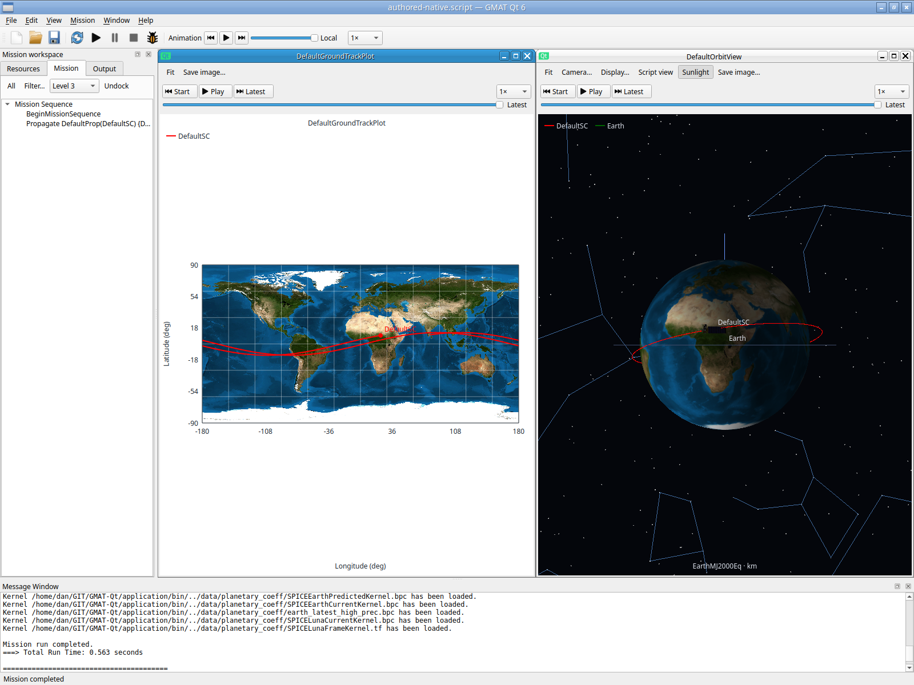

# Isolated X11 actual-input qualification — 2026-10-02

The actual `/home/dan/GIT/GMAT-Qt/application/bin/GmatQt` was operated through
XTest mouse/key events on private authenticated Xvfb with Openbox **3.6.1**.
This establishes the bounded X11 interactions below. It does not qualify the
user's GNOME/Wayland session, portals or hardware OpenGL, and does not establish
that the earlier GNOME Shell crash has been fixed. The Help tutorial construction
phase remains pending; no tutorial mission was used to seed these interactions.

## Isolation and identity

The reusable driver is `src/qtgui/tests/IsolatedX11Session.py`. It allocates a new
Xvfb using `-displayfd`, a private MIT-MAGIC-COOKIE-1 authority file and
`-nolisten tcp`. Each recorded session used its own server on `:2`, Qt `xcb`,
Mesa software GL/llvmpipe and a 1600 × 1200 screen, with a 600-second outer bound.
Openbox and its libraries were extracted under `/tmp/gmat-isolated-x11/wm`;
there was no system window-manager installation. Its explicit task config bound
Alt-F9 to iconify, Alt-Tab to restore/focus and Alt-F10 to maximize.

App/WM environment points to a fresh artifact-local mode-0700 `XDG_RUNTIME_DIR`,
private config/cache, private `--settings-dir`, generic desktop/QPA theme and an
explicit nonexistent private D-Bus socket address. Host Wayland/session-bus,
accessibility-bus and desktop-session variables are removed. No browser/folder
launch or host-display input was performed. Only owned app/WM/Xvfb process groups
are cleaned up. Both session records are closed: app exit `-15`, WM/server `0`.
This final app termination is harness cleanup, not an application crash claim.

Original startup bytes are retained as `original-startup.txt`. The only startup
clone change is the `OUTPUT_PATH` value; all selected plugin/data settings remain
as supplied by `application/bin/gmat_startup_qt.txt`, whose SHA256 is
`5f80be1f2dbe46faeb6d226328cace194d7770d086d5447c8b44928fb858559a`.
The cloned startup and output/log destinations are inside each evidence folder.

The baseline record `/tmp/gmat-isolated-x11/baseline.json` identifies branch
`codex/qt6-gui`, HEAD `5fdb3b186ceca35656cb6e1a77a067a3cb20cad2`, package/config
hashes, original startup and these binaries:

| Artifact | SHA256 |
| --- | --- |
| First session `GmatQt-R2026a` | `66b5d4a31e20c8ad55ef4d3714585f63b8d1440d4cb77853a653709b331c9123` |
| `libGmatBase.so.R2026a` | `febb403ef90c4ab4825c8849abe9199ab98c719491a128fe8cd138b3b30f8e02` |
| Guide session rebuilt `GmatQt-R2026a` | `a26d9a6c9d7a96df7b9b8a12c4f3218b7a803f8681aba83fb78e5abd2e50ce86` |

The baseline host-namespace probe records GNOME Shell PID **399961**, started
**2026-10-01 11:34:56**. Subsequent host comparisons retained that same process.
The default sandbox probe's lack of host process visibility was not evidence
that GNOME was absent. Separate desktop acceptance remains open.

## First actual-input session

Raw folder: `/tmp/gmat-isolated-x11/evidence/isolated-x11-eya7dcr4`.
`session.json` records `script: null`; this launch did not preload a mission.
The Welcome/New mission GUI generated the default mission, followed by actual
clicks and keys recorded with elapsed times in `actions.jsonl`.

| Interaction | Observed result | Screenshot in `screenshots/` |
| --- | --- | --- |
| New mission, maximize, F5 | Default mission completed; textured Earth, orbit and ground track visible; Message Window reports **0.662 s** | `002-new-mission-maximized.png`, `003-default-run.png` |
| Main Alt-F9, then Alt-Tab | Private WM unmaps/iconifies and restores the actual main window | `004-main-minimized.png`, `005-main-restored.png` |
| Ground-view minimize, Orbit close, Output double-click restore/reopen | One bounded viewer cycle remains usable; the settled Orbit view renders again | `006-ground-minimized-orbit-closed-output.png`, `007-viewers-reopened.png`, `008-orbit-reopen-settled.png` |
| Ground Stations category right-click | Category menu offers **Add GroundStation** and opens its typed creator | `009-groundstation-context-real-input.png`, `010-new-groundstation-form.png` |
| Edit minimum elevation to 21.5, Escape | Initial creation canceled; no station committed | `011-creation-cancelled.png` |
| Reopen creator, clear name, enter 21.5, Create | Pending blank name accepted as unused `GroundStation1`; unified editor shows 21.5° | `012-blank-name-pending-groundstation.png`, `013-groundstation-created-auto-name.png` |
| Ctrl-S, filename entry, Enter | Authored GUI mission saved to `authored-native.script` | `015-save-menu-state.png`, `016-gui-created-station-saved.png` |
| F5 after Save | Saved mission completed; displayed run time **0.269 s** | `017-native-pause-attempt.png`, `018-native-stop-attempt.png` |
| Mission Propagate editor, change elapsed stop from 12000 to 100000000, Apply, F5, F6 | Long in-memory mission reaches **Mission paused** | `019-mission-controls.png`, `020-propagate-command-editor.png`, `021-long-fixture-paused.png` |
| Shift-F5 after pause | **Mission stopped**, user-interrupted run; displayed time **1.150 s** | `022-long-fixture-stopped.png` |
| Ctrl-Z with plot/tree rather than script focus, F5 | Undo did nothing; long mission still running at capture; harness quit terminated it | `023-undo-long-stop-and-rerun.png` |

The rapid early viewer and Save captures were taken before all repaint/dialog
work settled. Screenshot `007` is followed by explicit wait/settled `008`;
`014-save-authored-gui-mission.png` still shows the resource panel, while `015`
shows the file chooser and `016` the saved state. Those early labels alone do
not establish failure or completion. The first short-run F6/Shift-F5 attempts
in `017`/`018` occurred after completion and do not prove pause/stop; `021`/`022`
provide that evidence on the deliberately long fixture.

The saved file still contains `GroundStation1.MinimumElevationAngle = 21.5;`
and `DefaultSC.ElapsedSecs = 12000.0`. The later 1e8 mission edit was unsaved.
The `023` rerun is **not completed** and is not counted as a successful rerun.
Completion/paused/stopped results above are read from displayed status/messages;
the retained application/GmatLog files do not contain those completion messages.
This exercise does not supply an independent scientific trajectory comparison.

## Body-guide follow-up

Raw folder: `/tmp/gmat-isolated-x11/guide-evidence/isolated-x11-xpvd2c0z`.
This separate rebuilt application opened the first session's GUI-authored
`authored-native.script`, as its `session.json` explicitly records. It did not
load a shipped/tutorial mission to bypass GUI construction.

Actual input opened Orbit setup, turned stars/constellations off, then opened
Advanced → Object drawing → Body guides. The Earth latitude/longitude grid and
local XY plane were set to Show through their combo controls; nested OK retained
pending edits until the parent Apply. F5 completed in **0.548 s**. Screenshot
`007-earth-grid-plane-native.png` shows the textured Earth and body grid with no
star/constellation background. A real left-button drag changed the view (`008`);
Fit then framed the extended local plane (`009`). These are actual X11/software
GL pixels, not model-only or in-process Qt captures.

The widget Save As chooser was used to save `guides-native.script`. That file
retains the station/12000-second authored mission, explicit stars/constellations
Off, and Qt camera metadata `objectGrids: {Earth: true}` and
`objectXYPlanes: {Earth: true}`. Controls/pending state, rendering and Save have
captures `005`–`011`; a subsequent reopen of the saved guide file is not recorded
here. Wider body/attitude/solver/replay combinations remain separate gates.

## Focus defect and repair history

The actual-input Ctrl-Z defect above led to a narrow MainWindow routing change:
Undo/Redo with non-text focus fall back to the selected script, while local
fields retain their own history and modal dialogs block background fallback.
Cut/Copy/Paste have no script fallback. `QtGui.FocusUndo` separately checks an
atomic GUI mission edit, tree/plot shortcuts, inactive document selection, local
fields, modal context and clipboard boundaries. The final focused result and actual-input retry are recorded below.

The first focused check failed in **0.27 s** at the test's hardcoded plot
Ctrl-Shift-Z Redo. The corrected fixture reads the actual QAction binding;
its next log confirms **Undo Ctrl-Z, Redo Ctrl-Y**, then fails later at modal
field-local Undo (**0.27 s**). Explicit modal activation/focus assertions expose
the actual cause in the third check (**0.26 s**): `QWidget::isAncestorOf` does not
cross the owned QDialog window boundary. The modal field has correct ownership
but was not recognized by MainWindow's existing focus tracker. The production
ownership check now follows the explicit parentWidget chain;
the modal guard remains in place. Only the first Redo failure was the assumed
shortcut fixture error. The modal failures identify a real routing gap and do
not constitute passing modal qualification. The initial failures are retained
in the durable isolated-x11 tree as `focus-undo-check-first-failed.txt`,
`focus-undo-check-modal-failed.txt` and `focus-undo-check-owned-modal-failed.txt`.
The final result follows below.

## Final focused result and actual-input retry

The final **QtGui.FocusUndo passed in 0.28 seconds** (0.29 total), with configured
Undo Ctrl+Z and Redo Ctrl+Y. It covers exact source restoration from Resource
tree and actual plot-timeline focus, field-local history, selected inactive
scripts, owned modal fields/buttons and no clipboard fallback. The fixture
executes one 120-second orbit after a 60→120 GUI source edit; it does not replay
the long native pause/stop scenario. See [focused log](check-focus-undo-20261002.txt).

The final application was rebuilt after the owned-dialog fix. Its SHA256 is
`9bc8115f4200bc4c933b72de2383cfe7722d79c463d148a64c029238b460ea8d`.

A third actual-input session, bounded to 300 seconds, separately checks the
original non-text Undo defect. Raw folder:
`/tmp/gmat-isolated-x11/focus-evidence/isolated-x11-44tcoe1_`.
It used application SHA256
`5c7245fb9d322aa4d142673f628c9839f9777281bdb44008c7fc30958e7d89c2`
(the same tree/plot fallback, before the final owned-dialog addition).
Actual GUI input opened the Propagate editor, changed the 12000-second stop to
100000000, clicked Apply and Close, focused the Mission tree, then pressed
Ctrl+Z. The displayed source returned to 12000.0, with no dirty marker. F5 then
completed in **0.563 seconds** with both textured displays. Save As through the
widget chooser wrote `undo-native.script`. It is **byte identical** to the first
GUI-authored `authored-native.script`; both SHA256 values are
`80e9c1b7f5ad901fadbb080ec32306008918cb48d0e6bf2dca416bd6b7d8687f`.
This retry establishes actual Mission-tree Undo and completed recovery; native
plot-focus Redo/modal behavior retains only the bounded offscreen check above.
The previously passed native pause/stop sequence was not repeated.

All three sessions closed; the final host probe still records GNOME Shell
PID399961, started 2026-10-01 11:34:56. This does not establish that the host crash
is fixed. Durable raw copies, including session manifests, action records,
settings, outputs, every timing capture and all three initial focused failures,
are in `build/example-qualification/20261002/isolated-x11/{first,object-guides,focus-fix}`
and adjacent logs/comparison JSON. Private authentication/runtime files were
removed during owned cleanup. Selected reviewable captures are in
`Qt6ParityValidation/isolated-x11-20261002`.

No old successful GUI/example matrices were repeated for this bounded phase.
GNOME/Wayland, portals, hardware-driver acceptance and Help tutorial walkthroughs
remain unqualified. Windows/macOS and MATLAB remain deferred. The full
replacement goal is unfinished.
