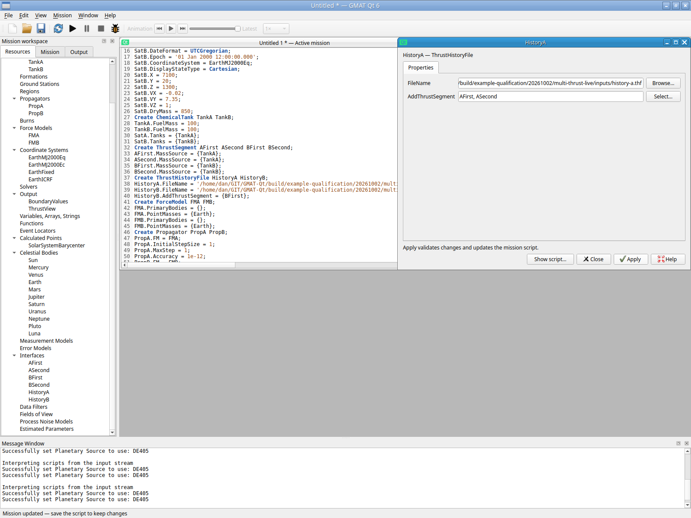
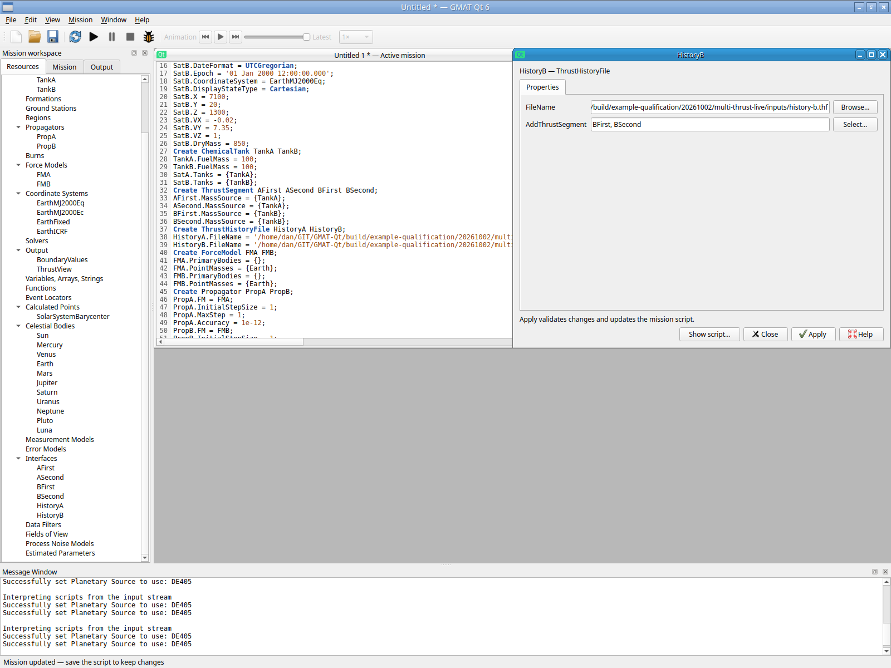
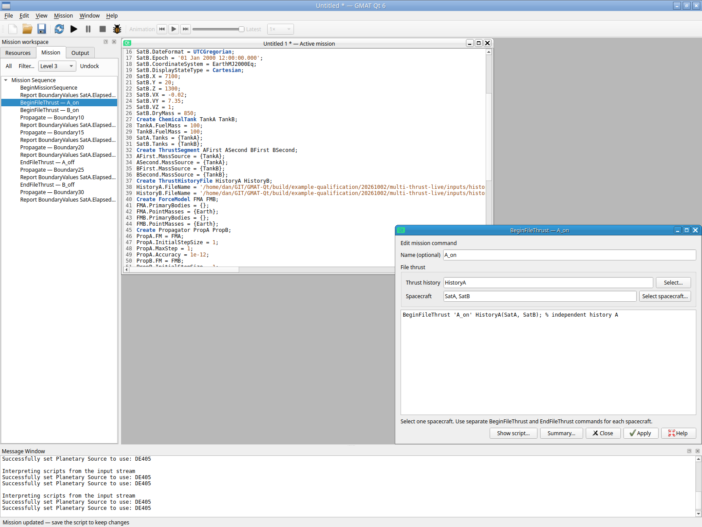
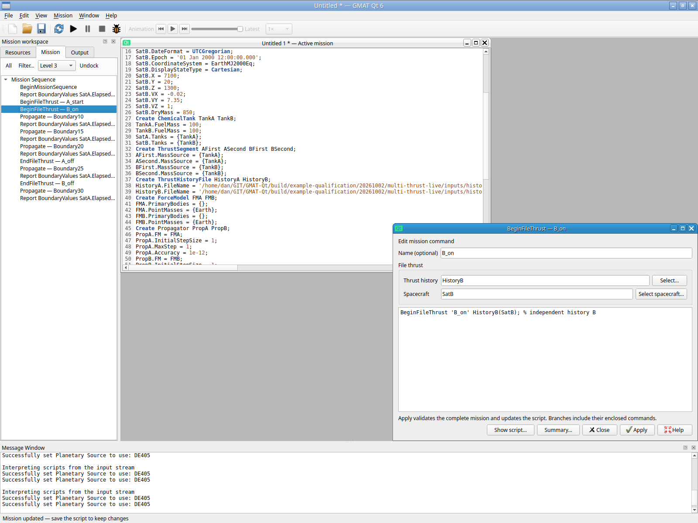
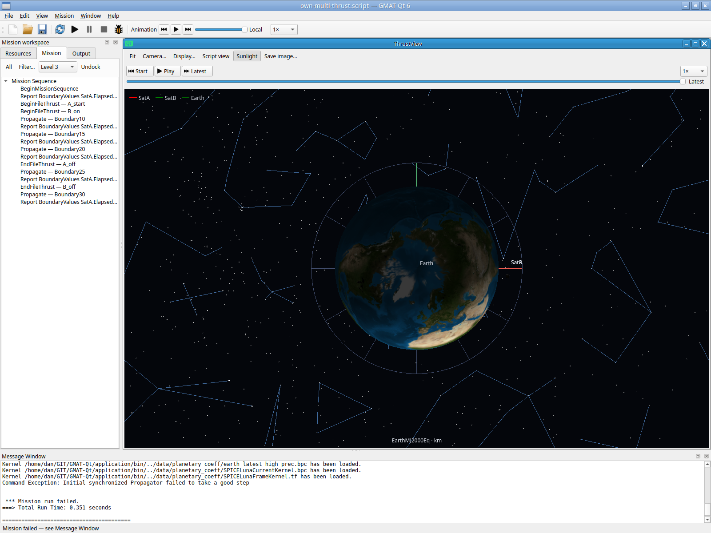
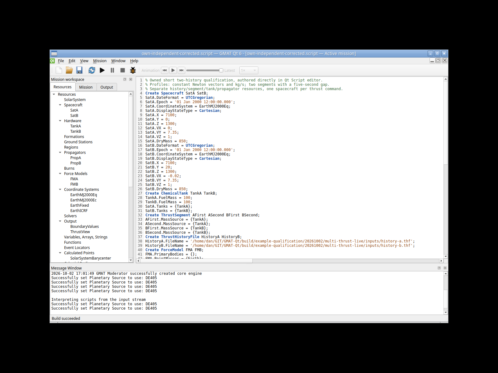
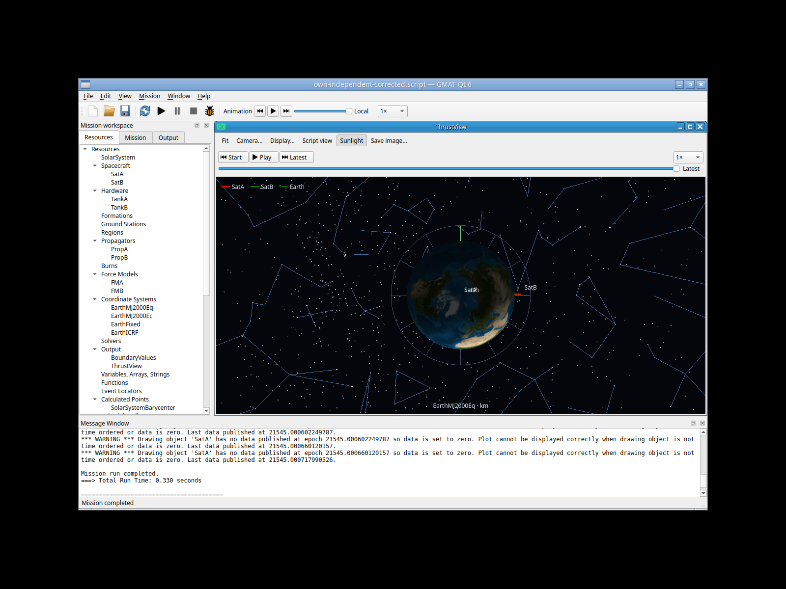
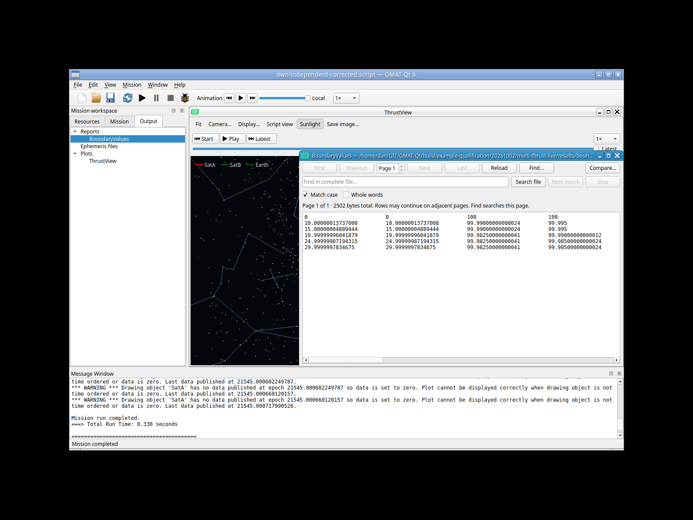

# Two independent thrust histories through the Qt GUI — 2026-10-02

Status: **Passed, bounded independent operation**. Actual Segment/History/Begin/End
controls, saved-source reopening, one corrected 0.330 s run and six analytic
fuel/time rows pass. The original synchronized run and first wrong-duration
sequential run remain failed qualifications; combined asynchronous OrbitView
fidelity remains unqualified. All attempts are retained.

[Final unchanged GUI-authored source](multi-thrust-live-authored-20261002.script),
[original synchronized source](multi-thrust-live-20261002/failed-synchronized.script),
[wrong-duration sequential source](multi-thrust-live-20261002/wrong-duration.script),
[HistoryA data](multi-thrust-live-20261002/history-a.thf),
[HistoryB data](multi-thrust-live-20261002/history-b.thf) and
[verified report](multi-thrust-live-20261002/boundaries.txt) are unchanged copies.
The archived sources retain their owned absolute input/output paths and are
evidence artifacts rather than portable shipped-sample recipes.

## Scope and independent inputs

This is a focused ordinary-mission workflow, separate from the Help walkthroughs.
No shipped/sample mission was loaded or used as a seed. Two small documented thrust
input files were independently authored as data; setup and mission statements were
then entered by real keyboard input into the actual Qt Script editor. Previously
covered ordinary resource-creation flows were not repeated after the initial
unsaved resource attempt. The distinctive Segment/History/Begin/End/Propagate
relationships were exercised through their retained forms.

The private authenticated X11/software-GL utility operates only its owned Xvfb,
Openbox and application processes. It provides actual XTest input and displayed
pixels. This does not qualify the user's GNOME desktop, Wayland, portal, physical
GPU, crash recovery or full Linux replacement gates. Windows/macOS/MATLAB remain
deferred.

Each spacecraft starts at UTC 2000 Jan 1 noon with its own 100 kg ChemicalTank,
850 kg dry mass, point-mass Earth force model and separate propagator. The histories,
segments, tanks and spacecraft are distinct. Profiles use `ModelThrustAndMassRate`,
constant Newton vectors, positive kg/s fuel consumption and `None` interpolation.
The vectors and mass-flow values are independent test inputs, not recovered
historical/sample values.

| History | Segment | Active interval (s) | Vector (N) | Mass flow (kg/s) |
| --- | --- | --- | --- | --- |
| HistoryA | AFirst | 0–10 | (2, 0, 0) | 0.001 |
| HistoryA | ASecond | 15–25 | (0, 3, 0) | 0.0015 |
| HistoryB | BFirst | 0–10 | (-1, 0, 0) | 0.0005 |
| HistoryB | BSecond | 15–25 | (0, 0, 2) | 0.001 |

A is explicitly disabled at 20 s, clipping its second segment; B is disabled at
25 s. Both coast to 30 s. Reports follow both spacecraft after each matching
boundary. Separate sequential propagation is appropriate to this bounded fixture
because the spacecraft have independent point-mass/thrust physics and no
inter-spacecraft force or coupled estimator interaction.

Format and sign evidence: `doc/help/src/Resource_ThrustHistoryFile.xml`'s
`ModelThrustAndMassRate` specification, the loader's non-overlap checks and
`FileThrust.cpp`'s forward `[start,end)` activation/force step limits. Exact source
paths, original input identities and the independent integral are retained in
`input-fixture-provenance.json` and the ignored analytic utility.

## Actual controls exercised

The 79-line independent initial setup was typed into a blank actual editor and
built with F7. ASecond/BSecond Segment forms read back TankA/TankB as MassSource;
the typed tank-only picker was exercised. HistoryA and HistoryB selection dialogs
added their respective second segment and Apply retained both lists. The saved
source includes the resulting quoted AddThrustSegment lists.

Begin/End forms use separate HistoryA(SatA) and HistoryB(SatB) commands. A typed
`SatA,SatB` Begin choice was rejected before Apply/source mutation with guidance
to use separate commands. The exclusive spacecraft picker and corrected SatA
Apply were exercised; optional command name `A_start` and the original comment
were retained. B Begin and both End forms read back the independent mappings.
The Boundary10 group control changed separate PropA/SatA and PropB/SatB groups
from Independent to Synchronized for the original attempted route. Actual Save As
and CtrlO confirmed the own source; both History forms were reopened afterward.

## Preserved first failures and corrections

The initial ordinary resource creation/rename/clone attempt was never saved;
its save dialog remained open and no checkpoint file exists. That earlier app787cd session acknowledged helper quit and performed controlled
cleanup with app -15 and WM/Xvfb 0; it did not close normally. It is partial evidence,
not a saved mission or completed resource-creation gate.

The GUI-authored synchronized source is 5,028 B, SHA
`b2acf1c27623292810fcb0be58e305e6d46cf26c4dbd66a0241fdfa9994cd163`.
Exactly one F5 failed in 0.351 s with `Initial synchronized Propagator failed to
take a good step`. The report contains only the initial row; no exact failure
epoch was exported. The word “Initial” identifies the leading propagator in
that code path and does not establish a failure at mission time zero.

`src/base/command/Propagate.cpp` (4968–5048) handles a finite-burn
`Step(false)`/segment restart in its Independent path but throws directly for
the leading Synchronized step. `src/base/propagator/RungeKutta.cpp` (449–495)
deliberately signals false after a valid force-limited segment step;
`plugins/ThrustFilePlugin/src/base/forcemodel/FileThrust.cpp` supplies those step
boundaries. This is a source-backed
candidate explanation, not an instrumented exact-step proof. No engine,
integrator, MinStep or algorithm change was made, and Synchronized multi-history
operation remains unqualified.

The own source was then reopened and edited through the actual editor: each of
five synchronized headers became an A-only Propagate with its original label,
followed by a separate B-only command. Exact comparison confirms only those five
headers/five new statements changed. The 5,213 B source SHA `2be9e152...` completed
one F5 in 0.349 s, but the analytic check correctly failed: elapsed rows were
0, 10, 25, 45, 70 and 100 s. `src/base/stopcond/StopCondition.cpp:1263` marks `ElapsedSecs` cyclic;
`src/base/command/Propagate.cpp:4433` resets its base and StopCondition.cpp:2286
uses `startValue + initialGoalValue`. It is relative to each Propagate
command's start; the original 10/15/20/25/30 stop values were durations, not the
intended cumulative report times. This is a fixture/operator semantics
correction, not a proved numerical-engine defect.

Only the eight later stop literals were replaced by 5 through actual Find/
Replace all. The first two 10 s values stayed unchanged; physics, profiles,
labels/comments, resources and report path did not change. The saved corrected
source is 5,205 B, SHA
`317e151e09253e9ef5fc30a57bfaf39b1765ec518170de291bfa1fd872a7417d`.
Its exact eight-literal comparison is retained. The session expired after this
Save and before the planned CtrlO/F5, with app -15 / WM 0 / Xvfb 0; that expired
attempt is not a corrected run or normal-close claim.

Typing corrections remain visible in the raw action history: oversized terminal
input and an unsupported wheel-count request were rejected before input; some
fixed-coordinate Find actions hit the moved dialog; an unsupported CtrlH shortcut
caused an unsaved accidental editor replacement. That replacement was Discarded
through the real unsaved-source prompt, and the exact saved own source was
reopened before the successful eight-literal edits. No erroneous pending source
was saved or run. In the final short session, initial Open/Enter timing and
filename autocomplete delayed acceptance. One premature F5 while the chooser
remained open executed no mission (006); its premature stale-report inspection
is separately retained, not attributed to the corrected run. The correct own
source was visibly built (007) before the sole effective F5 (008).

## Final corrected verification

Actual CtrlO/Open confirms the already GUI-saved correction and Build succeeded
(screenshot 007); one effective F5 completes in **0.330 s** (008). Actual Output
selection/Enter opens BoundaryValues (010). Its 2,502 B report SHA
`c2a06348a5f9b7068255dae4dbc7d1c8396a008e35afe05591ddadbb45a989bd`
has exactly six rows, each with 16 finite values. These expected fuel values pass:

| Time (s) | TankA (kg) | TankB (kg) |
| --- | --- | --- |
| 0 | 100 | 100 |
| 10 | 99.990 | 99.995 |
| 15 | 99.990 | 99.995 |
| 20 | 99.9825 | 99.990 |
| 25 | 99.9825 | 99.985 |
| 30 | 99.9825 | 99.985 |

Largest absolute time residual is **2.165325e-7 s**; largest fuel residual is
**4.121148e-13 kg**. The 5,205 B own source remains byte exact after reopening
and execution. Actual AltF4 closes the application normally: app/WM/Xvfb
0/0/0. The helper subsequently returns 1 for its already-exited-app diagnostic;
this final session is neither a mission timeout nor a crash.

The independent check integrates positive constant mass flow only on enabled
intervals, tests elapsed times within 1e-6 s and fuel within 1e-6 kg, and requires
16 finite values per row. Cartesian states are checked for finite values, not
against an independent trajectory truth solution. Backward burns, varying
profiles/interpolation, estimator solve-fors, full-day operation and broader
scientific qualification remain open.

The completed final scene (008) shows SatA at Earth's origin while the final
report gives its finite state near (7096.6168, 220.4652, 1329.3757) km. GmatLog
lines 32–35 explicitly warn that SatA is absent at epochs 21545.000486509049,
21545.000544379418, 21545.000602249787 and 21545.000660120157, each with the
last SatA publication five seconds later. Sequential B legs publish their
older/start epochs after A has advanced; association with individual commands
is inferred from their order and epoch differences, not instrumented.

The sequential run warns that the other unpropagated spacecraft was not
published and zero data is supplied to OrbitView. `src/base/subscriber/OrbitPlot.cpp:65` disables previous-data reuse,
`:2672` uses BufferZeroData and `:2734` warns. Its ordinary asynchronous
multi-spacecraft plot is therefore explicitly unqualified; report-based
independent thrust/fuel operation does not establish viewer fidelity.
`OrbitPlot.cpp:2328` passes all spacecraft names even when it has filled an absent
state with zero. `QtPlotReceiver.cpp:643–677` consequently appends that finite
zero as a real point; `PlotModel.hpp:134` permits zero coordinates. The renderer
uses the last retained point through the selected frame (`OrbitRenderer.cpp:299,
684`), so the final zero replaces the displayed latest SatA position. This is
a completed-scene defect, not temporary empty initialization. The callback path
appends rather than clears earlier SatA points; actual total retained counts
were not exported, so complete-history loss is not claimed. An explicit absence
indicator would be required to distinguish a missing spacecraft from legitimate
zero coordinates such as Earth at the origin. No viewer fix or further run was made.

## Runtime and durable evidence

Source base `2f9810c0...` includes the Region change; earlier one-spacecraft
FileThrust controls were prepared at `a922195f...`. The actual application is
5,926,536 B / SHA `244dc41a...`, base `cf147e23...`, util `1e4e7fe6...`, startup
`5f80be1f...`, ThrustFile plugin `e9788002...`, and private helper `4232bdb0...`.
Full identities/inodes/mtimes are recorded before each launch. The final short session's prelaunch record captured repository context 3fbd3089.
Documentation commits 2ad4b7ed and 07d590c2 were reported around this phase;
the captured value is historical context, not a claim of the final HEAD. Compiled
application source remains 2f9810c0 with the exact runtime244dc identity above.
The earlier new cardinality check passed 0.25 s after its preserved test-only
indentation expectation was corrected; it was not repeated for this workflow. The configured
ThrustFile plugin is required. No app relink, core change, repeated passing test
matrix or old corpus run was performed during this workflow.

Raw sources/reports, inputs, provenance, source diffs, analytic successes/failures,
actions, displayed PNGs and cleanup records remain under ignored
`build/example-qualification/20261002/multi-thrust-live/`. The original failure
report and the completed wrong-duration report are separately archived before
later output can replace the live report path. The final source/report/analytic
outcome is also archived unchanged in `corrected-passed-attempt/`; a future
viewer-specific affected retry must be recorded separately and cannot erase
this app244dc pass-with-viewer-failure snapshot. Selected images are unchanged
copies; source/hash evidence, not action labels alone, establishes each outcome.
