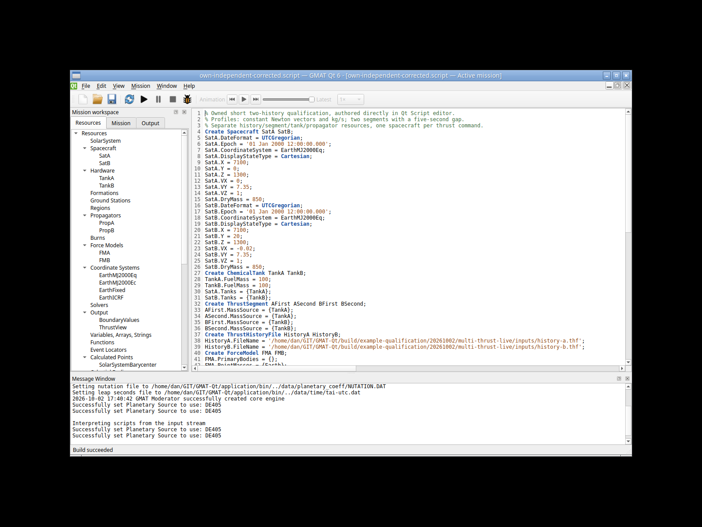
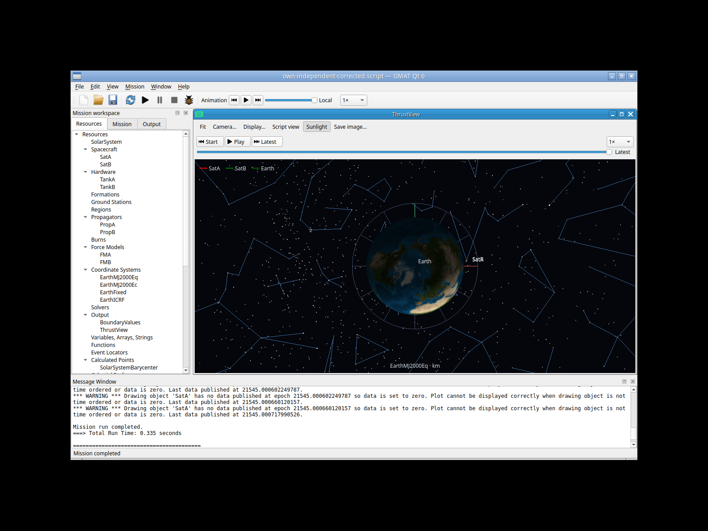
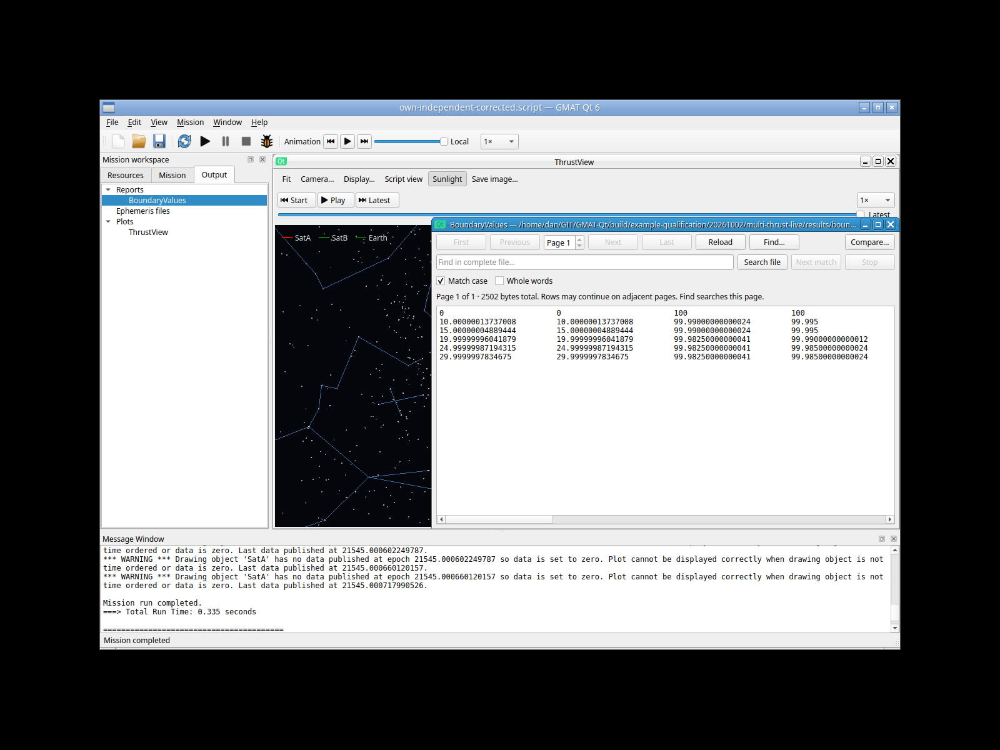
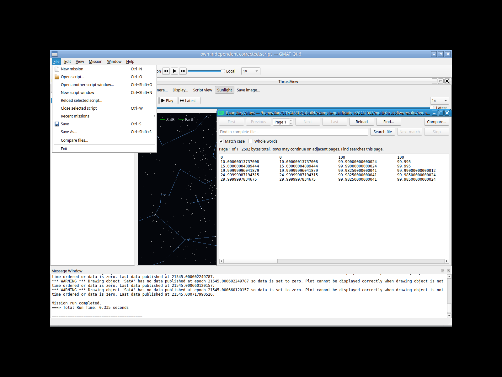

# Two-spacecraft viewer availability — affected native retry, 2026-10-02

**Passed, bounded completed-Latest scene and exact-report preservation.** One
actual-input retry of the unchanged GUI-authored two-history mission completes
in **0.335 s**. SatA and SatB appear near their orbital endpoints; Earth alone
is labelled at the view origin. The entire report remains byte exact. The
[original 244dc evidence](multi-thrust-live-20261002.md), including its bogus
SatA-origin scene and earlier failures, remains an immutable historical result.

## Single affected workflow

A fresh authenticated private Xvfb/Openbox/software-GL session closes Welcome,
uses actual CtrlO/Open on the already frozen own mission, and confirms Build
succeeded (003). The action log contains **one F5 key action and one effective
mission run**, followed by actual Latest-button selection (005). Actual Output
BoundaryValues selection/Enter opens the report (006). File → Exit is selected
from the displayed menu (007); application, WM and Xvfb exit **0/0/0** before the
180 s deadline. The helper returns 1 for its already-exited-app diagnostic,
separately from normal application exit; this is not a mission timeout or crash.

There was no source/physics/input change, resource/history form reconstruction,
new sample mission seed, extra lifecycle matrix or repeated old test here. The
[unchanged authored source](multi-thrust-live-authored-20261002.script) is the
same 5,205 B SHA
`317e151e09253e9ef5fc30a57bfaf39b1765ec518170de291bfa1fd872a7417d`.
Its original owned absolute input/output paths remain preserved.

## Scene correction and numerical preservation

Previously the core subscriber included SatA's name while filling its state with
zero during SatB-only publications. Qt treated that placeholder as a real latest
point, drawing SatA at Earth. The repair supplies explicit presence metadata and
skips absent spacecraft points with a line break, retaining legitimate zero
coordinates. [The implementation record](viewer-data-availability-20261002.md)
covers the callback, Current replay and segment-camera paths.

The new completed Latest pixels show both spacecraft labels at the close orbital
endpoint and only Earth's label at the centre. The nearby spacecraft labels
partly overlap. This is a bounded visible correction, not a calibrated pixel-to-km
comparison or exported complete-history count. Legacy core warnings still report
absent SatA and zero in its ordinary arrays; Qt now uses the separate mask to
omit those artificial samples. The warnings remain in the unaltered raw log.

The [2,502 B report](multi-thrust-viewer-retry-20261002/boundaries.txt) is identical
to the old immutable report, SHA
`c2a06348a5f9b7068255dae4dbc7d1c8396a008e35afe05591ddadbb45a989bd`.
The original independent checker passes all six rows at 0/10/15/20/25/30 s, each
with 16 finite values. Maximum elapsed residual is **2.165325e-7 s**; maximum
fuel residual is **4.121148e-13 kg**, within the declared 1e-6 s/kg bounds.
This full-report equality demonstrates preserved calculations for this scenario,
not broad numerical or trajectory-truth validation.

## Before/after bindings and retained artifacts

| Binding | Original completed run | Affected viewer retry |
| --- | --- | --- |
| Compiled production source | 2f9810c0 | 08cdda3c |
| Application | 244dc41a… / 5,926,536 B | 989d3499… / 5,935,320 B |
| Base library | cf147e23… / 25,036,288 B | 2082a341… / 25,040,656 B |
| Util/startup/helper/ThrustFile hashes | 1e4e7fe6… / 5f80be1f… / 4232bdb0… / e9788002… | unchanged |
| Own source / complete report | 317e151e… / c2a06348… | byte exact |

Full hashes, inode/mtime, captured source context, input identities and root's
build/source commit binding are retained in `prelaunch-provenance.json`,
`production-commit-binding.json` and `verification.json`. The post-run receipt
is recorded at **2026-10-02T23:46:23.056526Z**, after normal File Exit. All 138
previously indexed artifacts, including the old corrected-passed-attempt source,
report and scene, were checked unchanged. This receipt is a new affected result;
it does not rewrite the prior pass-with-viewer-failure status.

The new ignored evidence root is
`build/example-qualification/20261002/multi-thrust-viewer-retry/`, with private
session `isolated-x11-uwu930qb`. Its index retains 24 files / 1,515,247 B,
including 28 actions, seven unchanged displayed PNGs, source/report copies,
analytic result and cleanup. Four useful PNGs and the report are proposed for
promotion; no private authentication files, caches or application binaries are
selected. Raw evidence remains available independently of curated copies.

Only this finite completed scene is newly qualified. Synchronized thrust boundary
operation remains failed/unqualified. Native solver/Current replay, ground-track,
other publication mixtures, full-history/lifecycle cases and broader scientific
regimes were not rerun. Root's focused OrbitDataAvailability 0.31 s, affected
InvalidPlotData 1.49 s and SolverPlots 4.07 s results are separate controls evidence.
Host GNOME/Wayland/portal/hardware/GPU/crash and full Linux replacement gates are
not claimed; Windows/macOS/MATLAB remain deferred.
