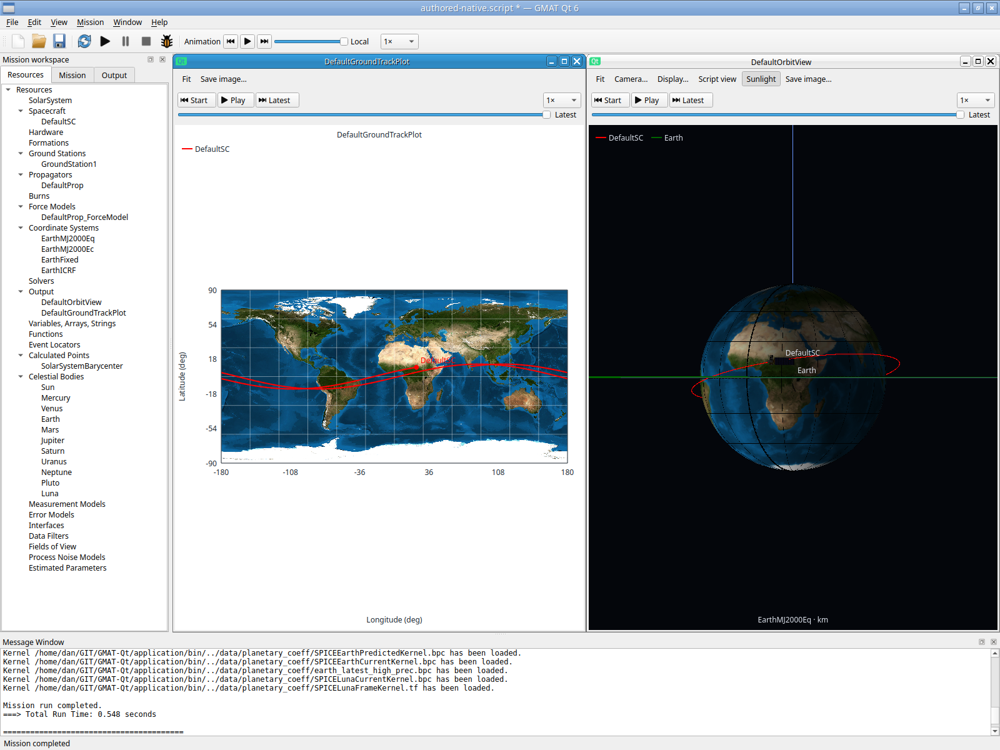
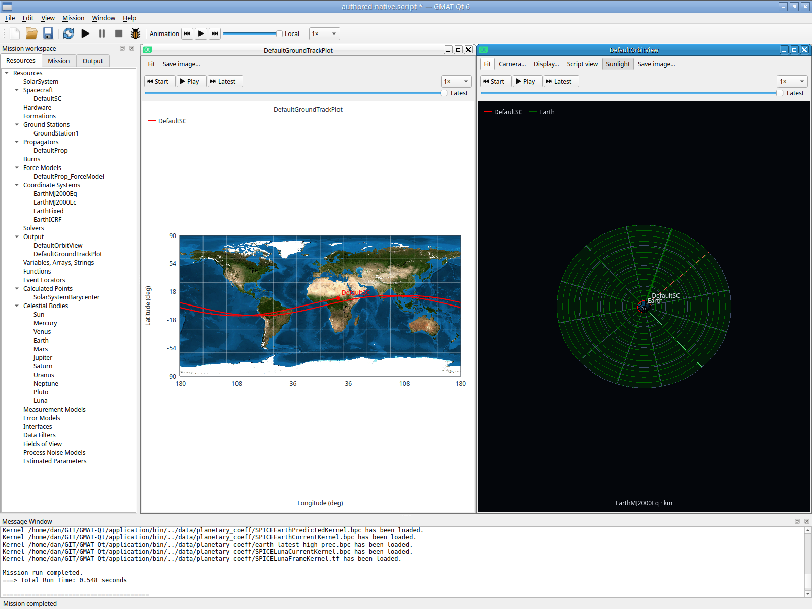

# Per-object latitude/longitude grids and local XY planes — 2026-10-02

## Result and scope

Qt now retains and edits OpenFrames `DrawGrid` and `DrawXYPlane` independently
for each selected space point. `DrawGrid` no longer combines per-object flags
into the plot-wide `Grid` setting. The **Object drawing → Body guides** page
provides Default/On/Off controls alongside the existing body axes. Default hides
the two new guides. Choices remain pending until the resource editor's Apply.

The focused offscreen **QtGui.ObjectGuides** check passed in **0.31 seconds**.
An actual application session under isolated X11/software OpenGL also shows the
Earth surface grid and filled, body-relative radial disk after execution,
mouse-camera movement and Fit. These establish the described feature and route;
they do not close host GNOME/Wayland, portal, hardware-driver, full desktop-input
or complete Linux replacement acceptance. No Help tutorial construction pass is
claimed. Existing successful matrices and example stages were not repeated.

## Authoritative OpenFrames semantics

The inspected R2026a reference dependency is outside the Qt development checkout:

`/home/dan/Downloads/GMAT/GMAT-src_and_data-R2026a/GMAT-R2026a/depends/OpenFramesInterface`

References below are relative to that exact dependency root:

| Reference | Behavior retained in Qt |
|---|---|
| `src/base/subscriber/OpenFramesInterface.cpp:65–107,123–129` | Per-object Boolean-array fields are `DrawXYPlane` and `DrawGrid`. Global `XYPlane` is a separate field. This source exposes no `DrawYZPlane`, `DrawXZPlane` or `DrawPlanes`. |
| `src/base/subscriber/SpacePointOptions.cpp:47–54` | Both new guide flags default to false. |
| `src/base/subscriber/OpenFramesInterface.cpp:1554–1558,1610–1628,1643–1660,2071–2078,2125–2132` | Braced Add rebuilds selected objects and resets flags. Boolean arrays update the available prefix, retain omitted defaults/current values, and ignore excess entries. |
| `src/gui/subscriber/OFSpaceObject.cpp:79–81,289–291,334–336,374–376,385,649–657` | Both guides are children of the same object reference frame, which follows position and attitude. Guide basis excludes the visible mesh's additional model offset/rotation. Guide visibility is independent of DrawObject. |
| `src/gui/subscriber/OFSpaceObject.cpp:204,228–229,322,353,359,379` | Radius is the visible model's bound, celestial equatorial radius, or 100 km for a plain/missing-model frame. |
| `src/gui/subscriber/OFSpaceObject.cpp:419–430` | Local XY disk has outer radius 15R, rings spaced R and spokes every π/6. Radial lines use orbit color; fill uses that color at alpha 0.2. |
| `src/gui/subscriber/OFSpaceObject.cpp:432–441` | Spherical grid uses radius R on each axis, latitude/longitude spacing π/8, black at alpha 0.9. It is distinct from a body's flattened visible mesh. |
| `dep/OpenFrames-git/src/LatLonGrid.cpp:147–148` and `dep/OpenFrames-git/src/RadialPlane.cpp:115–118` | Equator/prime meridian and zero-degree radial spoke have width 3. |

## Implementation

`QtCameraSetting` stores named `objectGrids` and `objectXYPlanes` maps in retained
Qt metadata. Conversion follows source assignment order and Add resets, retains
original lines as conversion comments, and preserves the independent global
settings. Malformed flags and nonexistent plane variants reject conversion with
original source unchanged. Existing warnings for unsupported velocity and other
OpenFrames fields remain; those capabilities are not qualified by this work.

Resource Apply, creation/clone metadata retention, Undo/Redo, Save/reopen,
renaming and Add-member removal use the named maps. Membership validation rejects
unknown objects. Removing one member prunes its guide entries without changing
another member's choices.

`OrbitObjectGuides.hpp` generates a spherical latitude/longitude grid and a
filled radial disk from recorded position, color and `bodyToView` attitude.
The native OSG renderer and fallback share this retained geometry. Native thick
meridians/spokes use the existing screen-space line shader; plane fill is
translucent and depth-tested. Fallback fills/clips triangles and draws guides in
depth order. Fit bounds include the guide extent. Invalid/nonfinite or
unrenderable latest poses produce no guide geometry instead of reusing an
earlier pose. Optional native arrays use scoped reference ownership.

Rendering and replay consult retained data rather than engine objects. Numerical
algorithms are unchanged; the focused source checks establish preservation of
unrelated mission text, rather than a new numerical reference qualification.

## Focused regression evidence

- Driver: `src/qtgui/tests/ObjectGuidesTests.cpp`.
- Result: **1/1 passed, 0 failed; 0.31 seconds**, from
  `/tmp/gmat-object-guides-check-20261002.txt`.
- Log SHA-256: `a56e6ff77359f7ea0729ef95a97ddb58204830e0b0fadec2e0f954e02e7eddc0`.
- Driver SHA-256 inspected at this checkpoint:
  `6ad18e8161d87a0500acc0ef0108aa85dcff991cd1f186bdb0b8e0acbf1369be`.
- Geometry helper SHA-256:
  `9d7634caee383097a2b56b2672e79f1df77cfc7ca81d5ca479c27fc34d6e30e6`.

Coverage includes source-ordered prefix/default/Add-reset behavior, metadata
round trips, global-setting and unsupported-warning retention, invalid
flags/metadata/plane names, independently checked spherical/body-space geometry,
15R extent, radius selection and opacity. Synthetic fallback cases cover
hidden-object guide visibility, replay position/attitude, hidden curves and
behind-camera handling. Actual retained resource controls cover Cancel,
untouched defaults, pending Apply, exact unrelated source/Undo/Redo, invalid
membership rollback, Unicode save/reopen, renamed members and pruning.
No numerical mission or native desktop test runs inside this focused driver.

## Actual isolated X11 application evidence

Raw session directory:

`/tmp/gmat-isolated-x11/guide-evidence/isolated-x11-xpvd2c0z`

`session.json` records the actual executable
`/home/dan/GIT/GMAT-Qt/application/bin/GmatQt-R2026a`, QPA `xcb`, a 1600×1200
private Xvfb display, Openbox and software GL. The original selected Qt startup
was cloned with **OUTPUT_PATH only** redirected; settings and outputs were
isolated. Executable SHA-256 recorded in the session and original build capture: `a26d9a6c9d7a96df7b9b8a12c4f3218b7a803f8681aba83fb78e5abd2e50ce86`.

`actions.jsonl` and screenshots document the visible route: open the saved
GUI-authored mission, open DefaultOrbitView, Advanced → Object drawing → Body
guides, set Earth's Lat/lon grid and Local XY plane to On, accept the dialog and
Apply. F5 completes with **Total Run Time: 0.548 seconds** visibly recorded in
screenshot 007. A mouse camera drag and Fit reveal the green radial disk with
rings, spokes and faint fill (screenshots 008–009). Save As preserves the authored
configuration in `guides-native.script`; screenshot 011 shows its saved title.

The final saved source is decisive about the global settings: **Grid = Off,
XYPlane = On**, with stars and constellations Off. Global XYPlane On is retained
from the original configuration; an earlier informal description of it as Off
was mistaken. The new metadata separately contains
`objectGrids:{Earth:true}` and `objectXYPlanes:{Earth:true}`. The native evidence
therefore shows added per-object guides while retaining the global plane, and
does not claim a native global-XYPlane-Off isolation test.

Saved authored source SHA-256:
`74223a8b7f4c82f50e09b7063b473c836b39cfabbae9d5e2f89e74276e3e6799`.

| Inspected screenshot | SHA-256 |
|---|---|
| `007-earth-grid-plane-native.png` | `0f795a04473f268b1326edb23682f9203683da94e9e342f5b2e7aaa7e59c119c` |
| `009-body-plane-fit-native.png` | `f7b9fa16976ac377a0c15853beebfcd38b84aec58483295ac5a7efd9e55ca0c7` |
| `011-guides-saved.png` | `6e90812a780b92c41f376aceb25c11b659bc1a944fdc64e3b367b5d922fc6c4c` |

The session was bounded and is closed. Its manifest records controlled teardown
(application exit -15; Xvfb and window manager exit 0), not an application-crash
or clean application-exit qualification. This route avoids the user's host
GNOME session; it does not establish a fix for the recorded compositor failure.

## Remaining limits

This is bounded native X11/software-GL and offscreen evidence. Exact OF
rasterization, all meshes/model-bound cases, other GPU/drivers, dense multiple
objects and wider camera/solver/Fit regimes are not established. The fallback
retains its existing simplified visible-mesh representation; loaded-model native
bounds do not establish identical fallback mesh pixels. Unsupported OF velocity,
other decorations and wider conversion capabilities retain their previous
limits. Host Wayland/GNOME minimize/focus, portal and broader keyboard workflows
remain open, and all interactive Help tutorial walkthroughs remain pending.
Windows/macOS and MATLAB stay deferred. Full Linux replacement qualification
remains unfinished.
