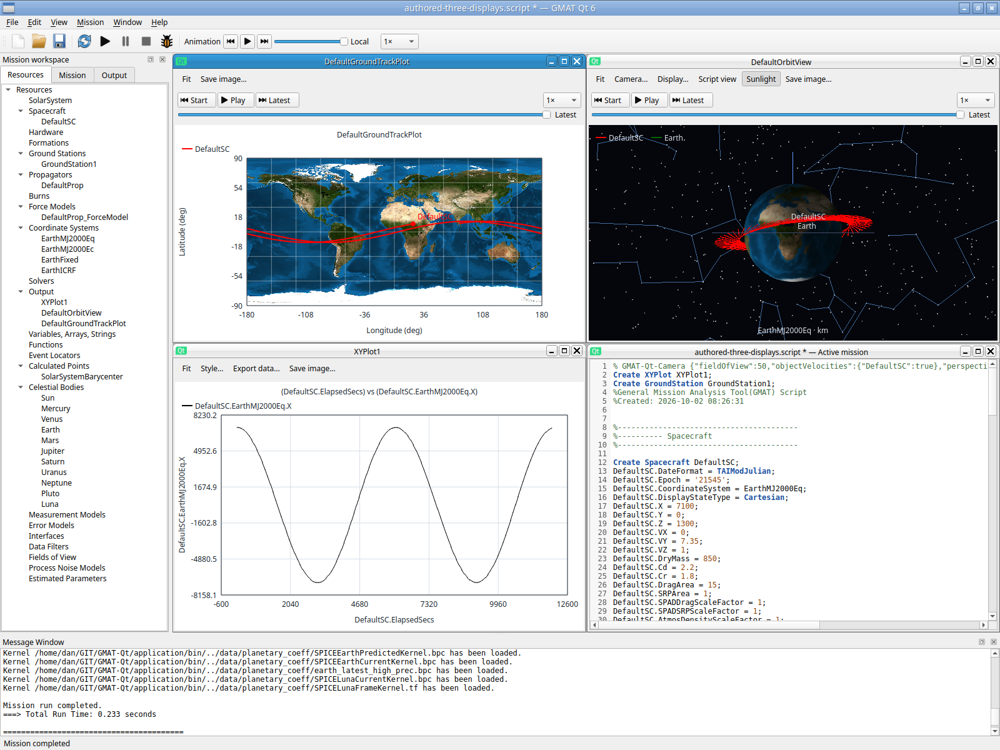

# Retained object velocity — 2026-10-02

OrbitView / Advanced / Object drawing / Paths and labels now supplies per-object
Velocity Default/On/Off. Default and Off hide it. It remains pending until the
parent Apply; Cancel, source Undo/Redo, Save/reopen, Rename and removal from Add
retain/prune the named settings consistently. OpenFrames DrawVelocity conversion
preserves source order, defaults, omitted prefixes, excess entries and Add resets.
Malformed arrays still fail explicitly.

## Authoritative geometry

The local R2026a OpenFramesInterface implementation records each view-frame
position and an endpoint `position + 1000 * velocity`: TrajectoryDealer.cpp
130–136,242–248, OFSegment.cpp92–110,170–180 and SegmentArtist.cpp161,195.
OFSpaceObject.cpp649–651 toggles those line segments independently. They are
unnormalized lines with a fixed 1000-second visualization scale, not integrated
future positions or arrowheads. Relative Velocity is not provided by this
backend; ThrustVector remains unimplemented there. Those unsupported converted
vector modes still fail precisely rather than displaying invented geometry.

Qt retains all three converted callback velocity components per PlotPoint,
including already-resolved non-spacecraft SpacePoints. Native and fallback
rendering use one geometry helper, actual historical sample colors and the
replay boundary; velocity participates in Fit and remains independent of path
and object visibility. OrbitPlot already converts the complete six-component
state into the view frame (OrbitPlot.cpp2488–2520).

## Focused and actual-input evidence

QtGui.ObjectVelocity passes **0.85 seconds**. It compares real rotating-frame
publisher velocities and positions with a Report, checks the independently
computed 1000-second endpoints, fallback replay/hidden-object behavior, history
trimming, source conversion, pending controls and rename/pruning. The fixture
explicitly sets Earth.NutationUpdateInterval=0: Report OrbitData forces nutation
recalculation while the plot uses the documented cached setting otherwise.
This aligns the two calculation paths without changing production numerics or
loosening the component tolerance. The initial cached-nutation comparison failure
and missing QDialog test include are retained with their dispositions.

QtGui.ObjectGuides passed **0.34 seconds** after its unsupported-field fixture
changed from now-supported DrawVelocity to DrawUsePropLabel. No earlier guide
matrix was repeated. Independent previous guide acceptance remains recorded.

Actual private X11 input opens Object drawing, changes DefaultSC Velocity to On,
then Apply/Close/run (**0.233 seconds**, warm run). Native textured Orbit displays
red velocity segments; saving retains the named metadata. Actual Output reopen
retains these lines at Latest.

The attempt to demonstrate native middle replay after reopen ended at Latest;
capture027 is not replay acceptance. Exact replay geometry is covered by the
separate offscreen check. See [viewer and shared-input evidence](viewer-preview-shared-20261002.md)
for identities, raw captures and driver limitations. No host compositor,
hardware-driver, all solver regimes or scientific-wide fidelity is claimed.

## Subsequent actual-input middle replay retry

[Workspace/native retry](workspace-reachability-20261002.md) resolves the earlier
inconclusive middle attempt. Fresh pixels confirm pending-panel Discard, accepted
master Start, real thumb drag to 47.6%, actual Orbit deletion and Output reopen.
The reopened native viewer shows velocity, Earth and trajectory at 47.6% while
Ground/XY keep the same shared position. This is bounded visible native replay
acceptance; exact velocity geometry/trim comparison remains the offscreen check.
