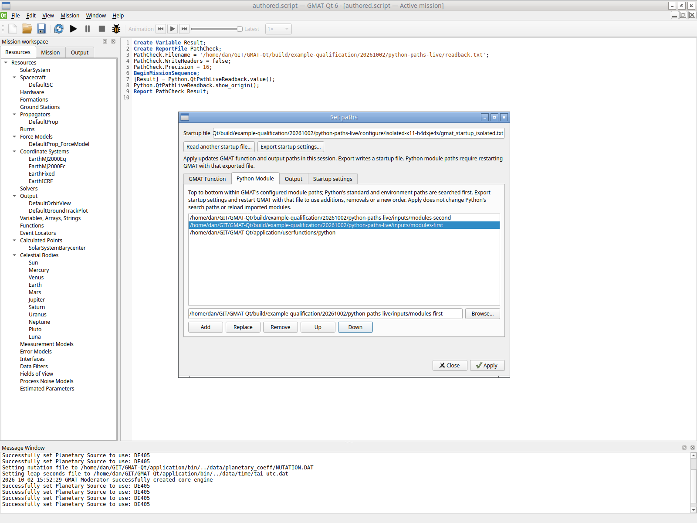
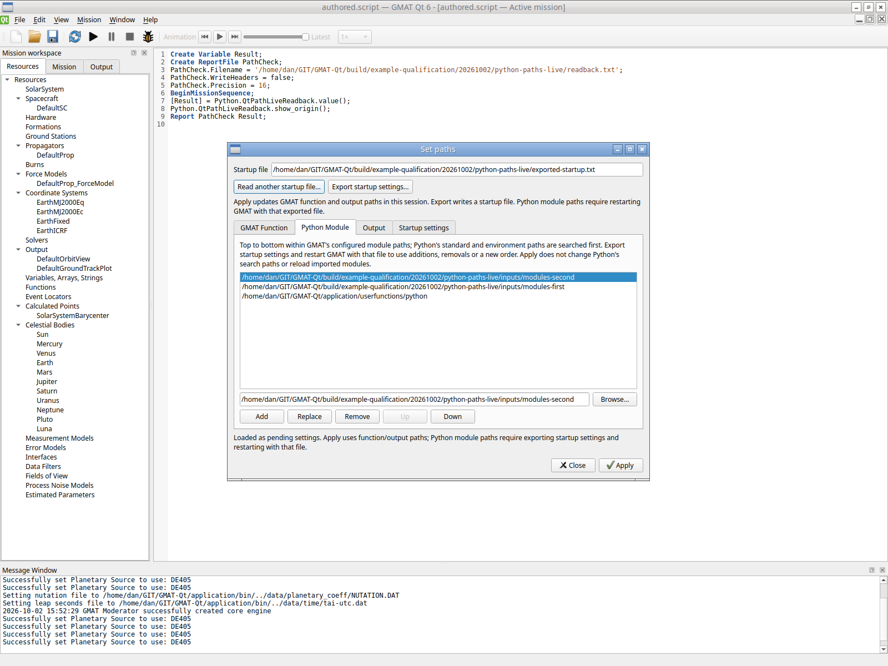
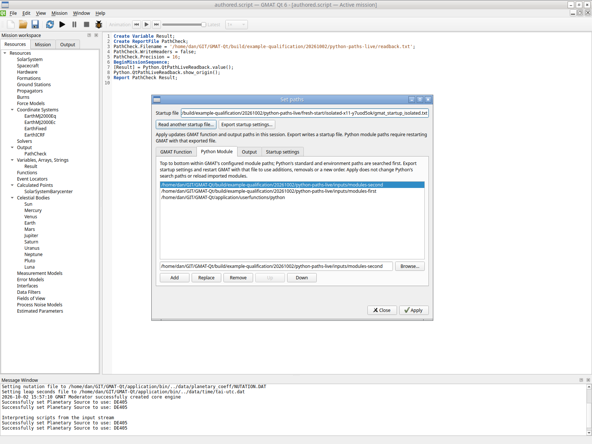
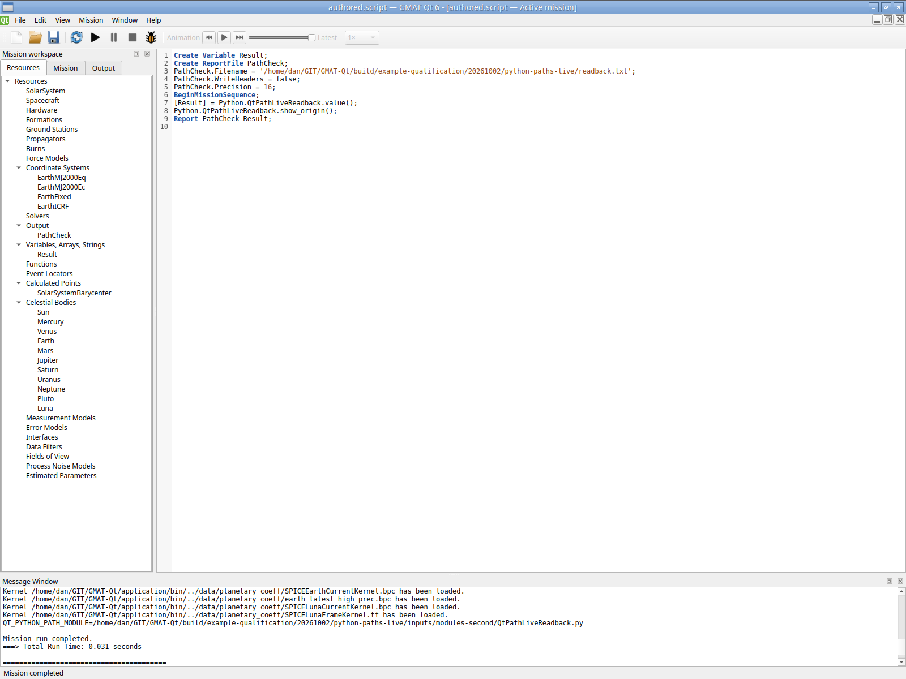
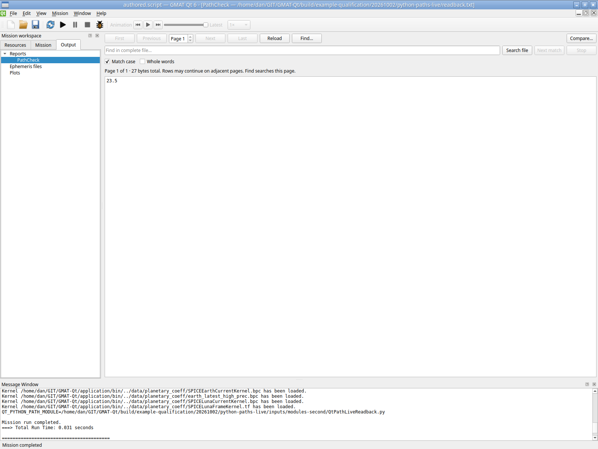

# Ordered Python module paths — 2026-10-02

**Passed within the selected Linux runtime:** Set paths now provides an ordered
Python Module list with Add, Replace, Remove, Up, Down and Browse. Export/import
retains the pending order; a fresh GmatQt process uses that exported order.
Apply continues to update function/output settings in the current session.
Python changes require **Export startup settings** followed by restarting GMAT
with the exported file. Apply does not change Python's search paths or reload
imported modules.

This is a shared search-path capability, not additional ExternalForce execution,
package support, cached-import recovery or full replacement acceptance.
Python's standard/environment paths precede the configured GMAT module paths.
Windows/macOS/MATLAB and the host desktop/physical GPU/crash gate remain deferred
or unqualified.

## Implementation and focused verification

Source commit `a922195ffdbd89172ee8d80dee4a5cd15e3052ec` contains the four
PathSettings/PathSettingsDialog files, directly affected PathTests tab indices,
new PythonPathTests and CMake wiring. No Python-engine restart, cache reset or
numerical-engine change was introduced. Imported pending rows are parsed from
their own startup source, independently of the engine's retained live Python
list. Export replaces the edited path assignments and retains other imported
source, including comments and custom aliases. Cancel and invalid Apply restore
the file-manager/global/log state; other-path Apply preserves live Python order.

The one combined production build passed. Directly affected `QtGui.Paths`
passed once in **1.20 s**. New `QtGui.PythonPaths` passed in **1.17 s** after a
test-fixture correction. Its retained passing stdout covers menu/tab controls,
Browse acceptance/Cancel, Add/Replace/Remove/Up/Down, alias-resolved import,
missing-directory and duplicate rejection, invalid Apply rollback, startup
export/Cancel/write failure/mission protection, unrelated source retention,
empty/reordered exported lists and two fresh-process independently known
**13.25/23.5** imports. The unrelated prior ScriptAssets/Python/ExternalForce
matrices were not repeated.

The first new test failed in 0.25 s with “Other path Apply lost an unknown startup
alias.” Source inspection established that the `_FILE_ABS` fixture getter
produced a double-leading-slash spelling, rather than lost data. The fixture now
uses the supported `_FILE` dirname/basename form and retains exact unrelated
source plus canonical physical-file checks. No production change followed this
failure. The original fixture, failure log and exact disposition remain in
`build/example-qualification/20261002/path-and-filethrust-controls/` alongside
`tests-2-detailed.log`, runtime/source identities and its artifact index. That
build's separate FileThrust fixture correction and passing result do not add
Python numerical coverage. Build 2 rebuilt tests only; the application hash
stayed unchanged.

## Actual private input workflow

Two private 600-s X11 sessions used only their owned XTest keyboard/pointer
input, private Openbox and software rendering. The helper cloned each startup
by changing **OUTPUT_PATH only**. No host desktop input, system bus or physical
GPU was used. Full actions, settings, logs, startup copies and all screenshots
are retained under
`build/example-qualification/20261002/python-paths-live/`.

1. From Welcome **New mission**, the nine-line test mission was typed through
   the script editor, saved as `authored.script` and later reopened with Ctrl+O.
   Build succeeded; no Python mission was run in this configuration session.
2. **Edit > Set paths > Python Module** initially showed the installed directory.
   Two owned module directories were added; Down moved `modules-second` above
   `modules-first`. The first module returns the declared constant 13.25 and
   the second 23.5. Both print their own `__file__` when requested.
3. **Export startup settings** wrote `exported-startup.txt`. Its exact rows are
   second, first, installed directory. **Read another startup file** loaded that
   export as pending state with the same order and explicit restart guidance.
   Close discarded pending changes. Own mission Ctrl+O/Build succeeded again.
4. A fresh private application launched with the exported startup and the saved
   own mission. Set paths showed the same second/first/installed order. One F5
   run completed in **0.031 s**. The Output report viewer showed **23.5** and the
   message/log recorded the exact module origin in `modules-second`.
5. Actual Alt+F4 closed both applications normally. Both session records show
   app/WM/Xvfb **0/0/0**, and all six recorded process IDs were absent during
   scoped cleanup verification. The helper CLI's exit 1 is its diagnostic for
   observing an already exited owned application, separately from the app's
   normal exit; neither session reached its 600-s deadline.

The initial typing protocol mistakes are retained: multiline text was rejected
by the helper, then the unsupported key name `RETURN` left concatenated text.
Those drafts were cancelled and replaced through actual Ctrl+A/linewise
text/`ENTER` input; neither was saved or run. Screenshots 003–005 and successful
action history preserve the correction. Rejected actions are not logged by the
helper's successful-action logger; their exact error text and disposition are
retained in the workflow metadata. These are harness mistakes, not accepted
mission outcomes.

## Identity, outputs and bounds

| Artifact | Bytes | SHA-256 |
| --- | ---: | --- |
| GmatQt-R2026a | 5,876,904 | `787cd09bfd865d168313e9f0d7b71e0b7edd419aed43b6db8b5641826d1da3dd` |
| Authored script | 359 | `920a1a478a8054f408d4a36b60479218dce1f52bc55e8463c0abc9c0039f851e` |
| Exported startup | 10,297 | `1a7a9b9618bfa9dd5ee60ec41a3e8d66fb38d11a97bd7a9cfdb6b0f1d2e3bf55` |
| Report | 27 | `7c94cf68abb86687a8f676eb9018ea132d84dacc8cd497f52c62bba5c90afbda` |
| First module | 97 | `3483e284badd9460ce89f62adafe99d96b7605dff1792272558f8974ed297998` |
| Second module | 96 | `541163805c138456d42f5d6b14b42e50757f89ee706e0d570c1a2fb6c410641e` |

The authored source hash remains unchanged after reopen and execution. The
report contains one finite row, `23.5`, with no headers. The log contains:

```
QT_PYTHON_PATH_MODULE=/home/dan/GIT/GMAT-Qt/build/example-qualification/20261002/python-paths-live/inputs/modules-second/QtPathLiveReadback.py
```

Base `cf147e23…`, util `1e4e7fe6…` and production startup `5f80be1f…` are
unchanged. Both helper session records independently retain the complete app
hash and their distinct OUTPUT_PATH-only startup hashes. The complete original
47-file/5,064,944-byte workflow tree is indexed before adding qualification
metadata; five selected PNGs are copied unchanged for review.











This qualifies saved startup ordering and one fresh import, not live editing of
an imported module, arbitrary package/environment precedence, custom-path
ExternalForce execution or native host/Wayland/portal behavior. Existing bounded
private portal evidence remains separate. No further mission, test matrix or
corpus stage was run.
