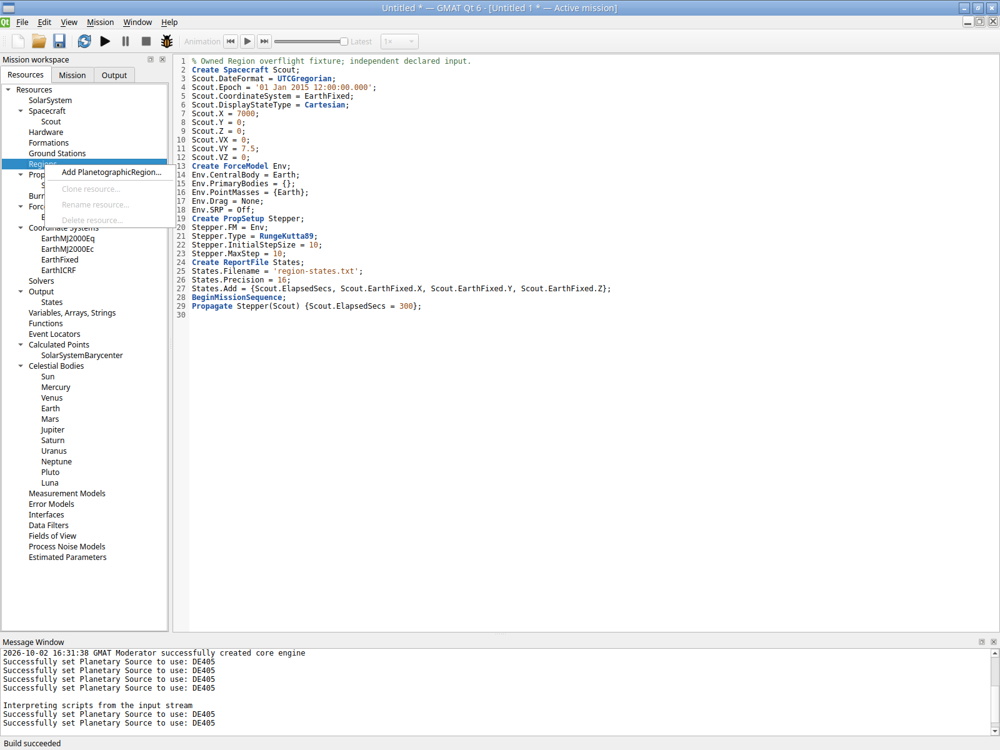
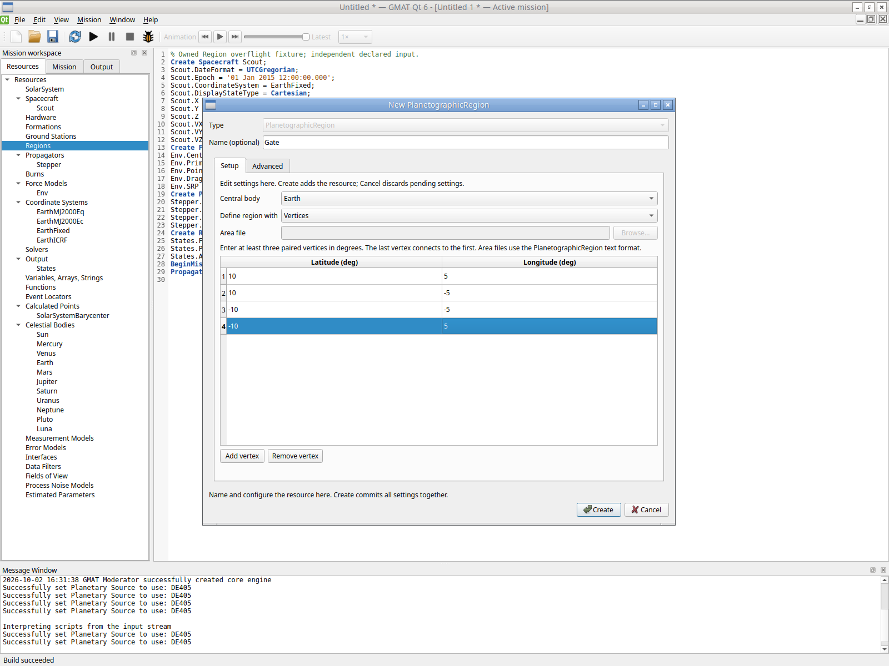
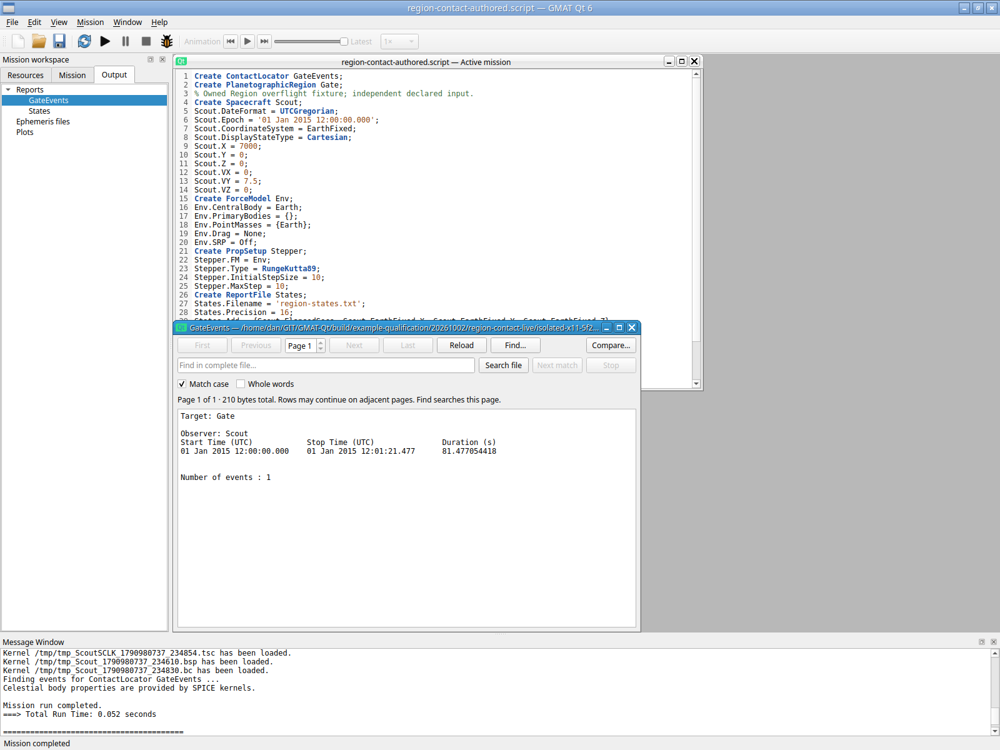
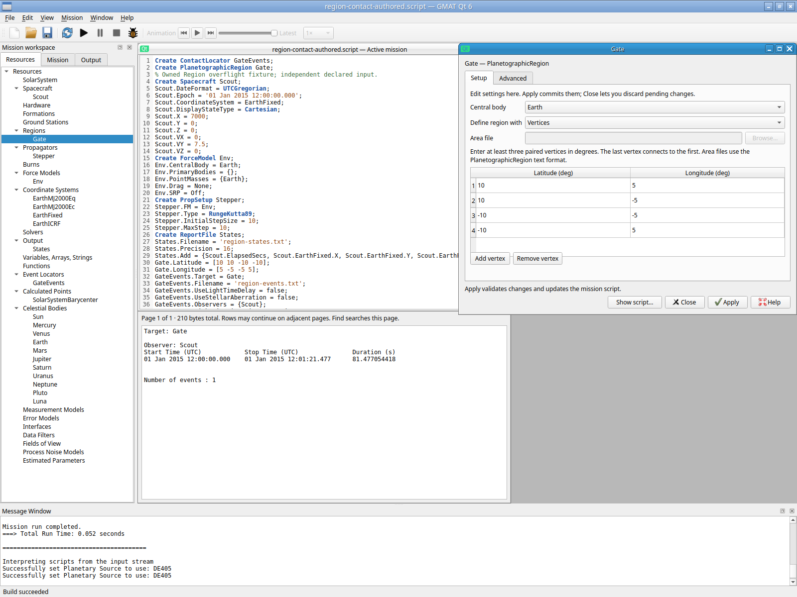
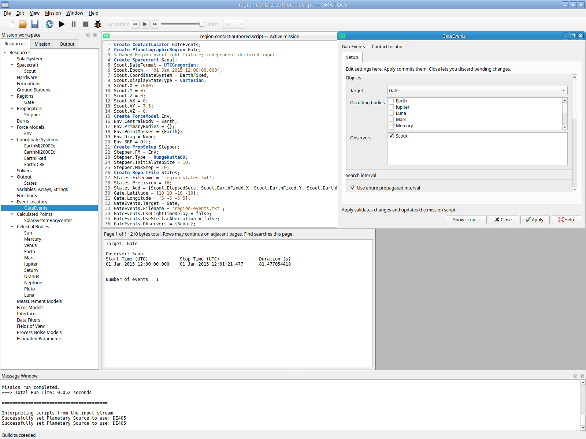

# Earth Region overflight through the Qt GUI — 2026-10-02

One ordinary PlanetographicRegion target with one spacecraft observer passes a bounded private X11 workflow. The paired vertex form is created from the new Regions category, the saved configuration reopens, and a single short mission produces a nondegenerate contact consistent with independently reported spacecraft positions. This closes this selected workflow, with broader locator/scientific and host-desktop qualification still open.

The authenticated Xvfb/Openbox/XTest session starts with GUI New mission (`script:null`). Twenty-nine independently declared spacecraft/force/propagator/report/mission lines are typed into the actual Script editor and built with the toolbar. No shipped mission/sample, engine API or Qt model setter seeds the source. Actual Regions right-click offers Add PlanetographicRegion (006); the creator's paired table receives four rows, Latitude `[10 10 -10 -10]`, Longitude `[5 -5 -5 5]`, and Create commits Gate (008–009). ContactLocator is created from its category; changing pending Target to Gate offers one checked Scout spacecraft, and its report/output controls select corrections off, Legacy and `region-events.txt` (014–017). These resource operations use the unified form; the independent scaffold is explicitly keyboard-entered Script configuration.

Declared input is Scout at UTC 01 Jan 2015 12:00:00.000, EarthFixed Cartesian (7000, 0, 0) km and (0, 7.5, 0) km/s. Env uses point-mass Earth with no drag/SRP. Stepper is RungeKutta89, InitialStepSize 10/MaxStep 10 s, propagating 300 s. Gate's Earth rectangle is ±10° latitude/±5° longitude. GateEvents uses the whole propagated interval, Automatic, StepSize 10 s, one Scout observer/no imager, WriteReport, UTCGregorian and Legacy report. Unchanged engine defaults remain implicit in the actual saved source; no extra generated defaults are introduced merely for documentation. States records ElapsedSecs and EarthFixed XYZ at every retained step.

Exactly one F5 run completes in 0.052 s. The contact report contains Target Gate/Observer Scout and exactly one event from 12:00:00.000 to 12:01:21.477 on the declared 2015 date, duration 81.477054418 s. The independent States report contains 31 finite rows through 300 s. `atan2(Y,X)` gives 4.909418552898845° at 80.00000015599653 s and 5.522603909747899° at 89.99999997904524 s, bracketing the +5° exit and reported event. Linear interpolation of those 10 s samples estimates 81.47722795484304 s, differing by 0.000173537 s. This is an approximate consistency check, not exact event/frame identity or an asserted numerical accuracy threshold: ContactLocator.cpp:2670/2867–2898 uses the selected SPICE body-fixed frame, while States reports GMAT EarthFixed. No independent full scientific validation is claimed.

Actual Output-tree Enter opens the populated report (023). GUI CtrlO reopens/builds the saved own script; the Region form retains the exact four pairs (025), and Contact readback retains Target Gate, one checked Scout and whole-interval mode (026). The saved source stays 1186 bytes, SHA 2825e9fdcafebf712983d9720fc3b0b4414a8ccfd340cae1d33f346f81710830 before/after reopen. Report SHA f43adae997571e7e09fa4e89b42c18c4dea939f3b52572f022344108e60f988b; States SHA 9934792328aebc2e4855eae6d073e6ababea82a4a01211e9c2cd49419b2218dd. [Machine-readable checks](region-contact-verification-20261002.json) and the unchanged [authored source](region-contact-authored-20261002.script) preserve the declared inputs and reported bracket.

The focused source checkpoint is 2f9810c0. QtGui.Region passes in 0.36 s: actual creator/Cancel and untouched blank rejection, paired finite/core validation rollback, 4→3 replacement, file/vertex switching with original inline comments, initialized-file one-mode serialization, exact unrelated source/Undo/Redo/Unicode reopen, pending Region target/one-spacecraft cardinality and preserved existing non-Region GroundStation+Spacecraft choices/imported Cancel. No numerical mission runs occur in that check. The directly affected QtGui.EventLocators passes in 4.65 s once and is not rerun after its success. Controls evidence remains `build/example-qualification/20261002/region-controls`, indexed with the original failures and source/runtime identities:

- Initial creator failure was production omission of Gmat::REGION from available types and resource categories; the exact failed MainWindow/test sources are preserved before the narrow route fix.
- The original replacement count failure did not establish appended data. One improved diagnostic showed unchanged 4/4 model/source. The serializer's generic list overlay attempted an engine lookup for already consumed `@RegionSource`, rejecting Apply. Skipping grouped Region keys repairs the real cause; no core list/reset algorithm changed.
- The explicitly initialized detached-file fixture lacked SolarSystem context. Build-only configured resources need not have Sandbox context; the fixture now installs that context. This correction changes no production code. The interrupted first build and incremental continuation outcomes are retained separately.

The native helper's initial immediate Enter after typing a Save filename did not yet accept the dialog; screenshot 019 shows it still open. No source was committed or mission executed by that unsatisfied sequence. The actual Save button then saves the source before the single F5 run. All original screenshots/actions remain; this is harness timing, not another failed numerical mission or a hidden rerun. Actual File→Exit yields app/WM/Xvfb 0/0/0. Helper exit 1 reports the already normally exited app on its next queued wait; it is not an application crash or forced stop.

Raw evidence is `build/example-qualification/20261002/region-contact-live/isolated-x11-5f2p9ghn`: all 27 unchanged PNGs, actions/session JSON, saved source, original/OUTPUT_PATH-only startup clone, logs, report and States. Application 244dc41a2402dbf7b7235027c02b840f0319b77bafd4798bf23617a9645c11f0/5,926,536 B; base cf147e23..., util 1e4e7fe6..., production startup 5f80be1f... remain controlled. Private authenticated display :3, settings/runtime/no-host-bus/software GL do not touch the user's display. This evidence adds no GNOME/Wayland/portal/hardware/crash guarantee or full Linux replacement completion. Windows/macOS/MATLAB remain deferred; no old station/Mercury/FOV/corpus matrix or successful test was repeated.

