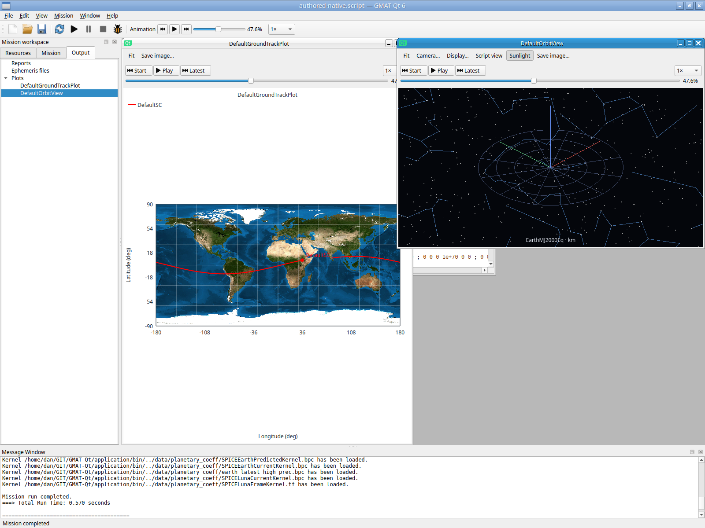
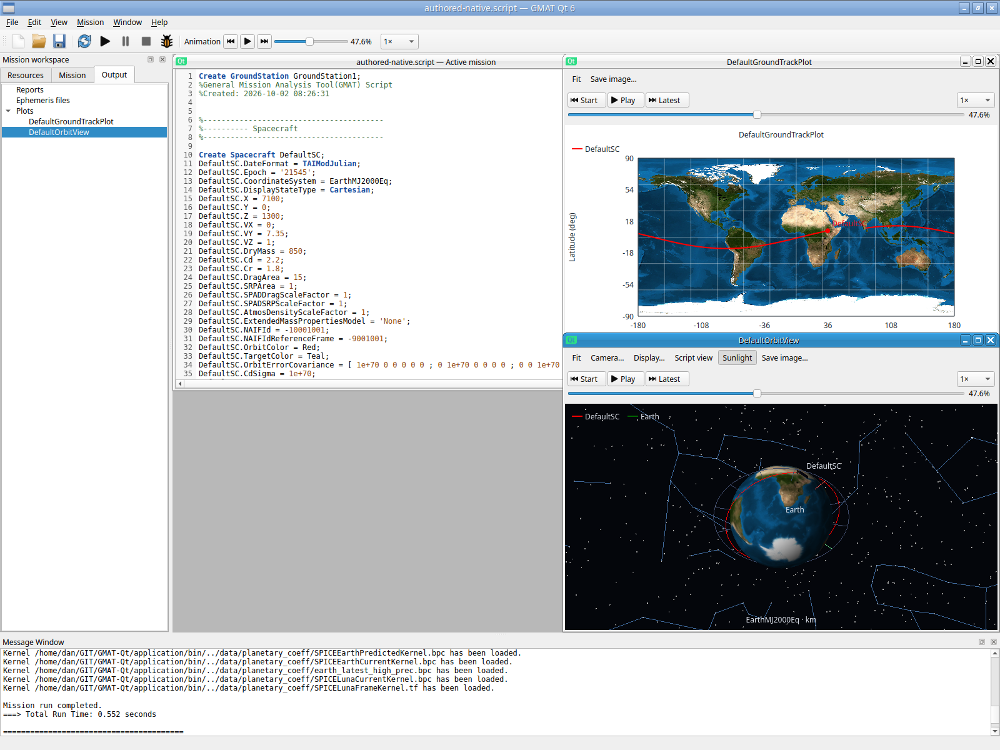
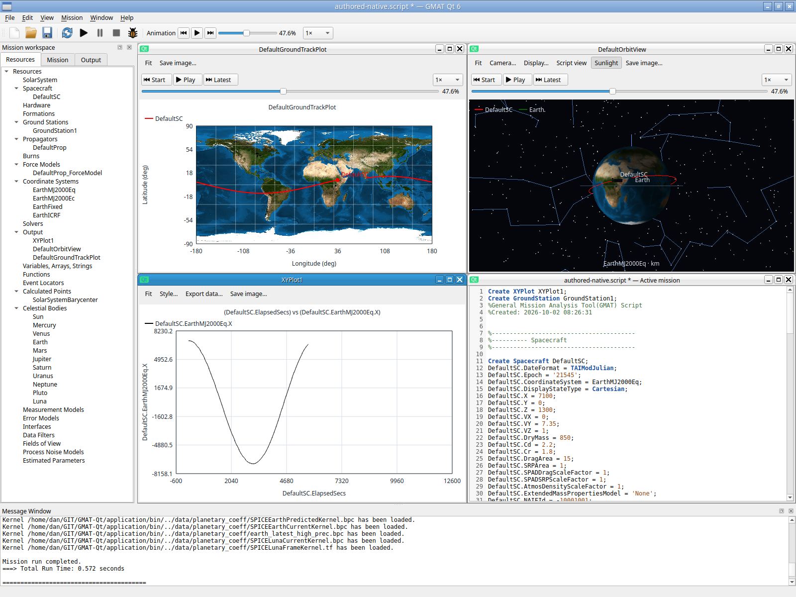
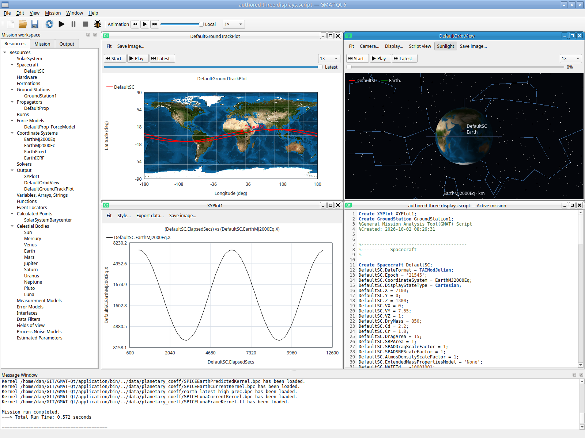
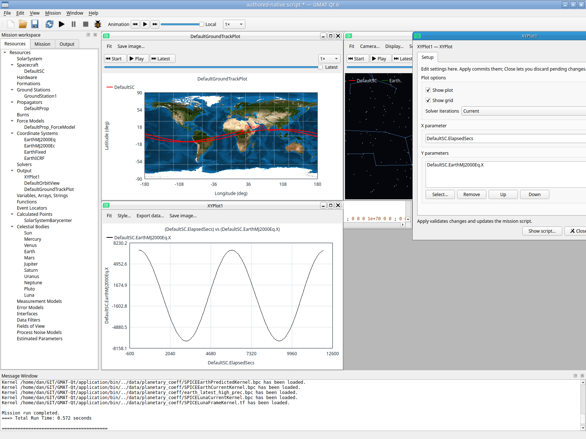

# Viewer preview lifetime and shared actual-input displays — 2026-10-02

## Demonstrated defect and fix

Closing an unedited OrbitView settings panel destroyed its same-name validation
clone. OrbitView::~OrbitView emits `ClearObjects` for that name
(src/base/subscriber/OrbitView.cpp:304–306), so the receiver cleared the real
viewer too. Deleting/reopening the viewer then showed axes/stars without its
Earth, trajectory or legend. Latest and Fit did not recover the lost objects.
The original failed actual-input session is retained.

`ResourcePreview.hpp` supplies a custom deleter for frontend-only factory drafts,
validation and serialization clones. Its synchronous cleanup scope suppresses
only their `ClearObjects` callback in QtPlotReceiver. Ordinary engine cleanup
still clears real displays. Engine-owned objects and numerical propagation are
unchanged. All generic Orbit-capable frontend owners use the guarded lifetime;
remaining normal owners are restricted to other resource types.

QtGui.PreviewLifetime passes **0.89 seconds**. One 120-second mission tests exact
retained model/camera/color bytes, clean close, nested Cancel, no-op/invalid Apply,
Discard, serializer/rename/Clone cancellation and real widget deletion/reopen.
An ordinary PlotInterface ClearObjects still clears Orbit while preserving Ground.
Its first fixture assertion incorrectly required exactly two curves; OrbitView
adds a hidden Sun for lighting. The corrected assertion requires the authored
Spacecraft/Earth, with diagnostic names. Raw failure remains preserved.

## Actual private X11 retry

XTest mouse/keyboard input operated the real application on authenticated private
Xvfb/Openbox with software GL and private settings/output. The startup clone
changes OUTPUT_PATH only. An already independently GUI-authored 12000-second
mission completes **0.552 seconds**. After shared scrubbing to **47.6%** and actual
camera drag, clean settings close, viewer deletion and Output reopen retain Earth,
trajectory, legend and the rotated camera. Three main minimize/restore cycles
have unmapped-state records, with two viewer deletion/reopen cycles and one
viewer minimize/Output restore cycle.

This session used binary SHA256
`92105289c6c0bedbb5f67e246328be56c36fe5c5b1ca88c5cee9acef3c2721c1`, core library
SHA256 `febb403ef90c4ab4825c8849abe9199ab98c719491a128fe8cd138b3b30f8e02` and
selected startup SHA256
`5f80be1f2dbe46faeb6d226328cace194d7770d086d5447c8b44928fb858559a`.
Source SHA256 `80e9c1b7f5ad901fadbb080ec32306008918cb48d0e6bf2dca416bd6b7d8687f`
is unchanged. The later command-serialization fix changes the shared core library
without changing this executable, so both runtime identities are recorded.

## Three-display controls and a new window finding

A second actual-input session creates XYPlot through Output / Add XYPlot, leaves
the optional name empty, types X and uses the ordered Y picker. A **0.572-second**
run produces Orbit, Ground and XY. Tiled displays share **47.6%**; Start, Play for
750ms and Pause stop at **27%**. Captures 007/008 are byte-identical after 500ms,
SHA256 `9f37f3862f93216448be843a83d71433e2dc1001934a61d880359451feed2f70`.
A real per-Orbit Start switches the readout to Local while Ground/XY stay Latest;
global Latest rejoins all three. One more main minimize/restore repaints correctly.

The retained XY settings panel activated from Window was partly beyond the
1600-pixel viewport. The selected settings panel must be clamped after its
layouts settle; it must retain pending edits and leave other windows alone.
The separate workspace check/retry records its resolution.

After actual velocity On / Apply / run, Orbit shows the per-sample red segments.
The final independently authored source is saved, SHA256
`2d30468533a50b6495871e381803045d687fc0429b504b4d6739f2b8cd37e8a4`.
It contains XYPlot1, the ordered variables and DefaultSC velocity metadata;
the original mission sequence is unchanged. The exact final source is also
retained as [the authored three-display fixture](shared-three-authored-20261002.script).

This second session used the same executable/startup identities above and core
SHA256 `5eb86098fbc52890a95d3226c56a4edd8e090308a940bb097749e23237532ab9`.
Do not infer cases from screenshot filenames: 010/011 acted on the global slider,
not a nonexistent Local checkbox; 013–017 still show SaveAs and establish neither
save nor local playback. 018 confirms the eventual save. The HOME keysym failed;
a later DOWN selected velocity On. 027 shows reopened velocity at **Latest**,
not the attempted middle replay; native velocity replay remains unqualified in this session. Source review
confirms Apply/build clears shared playback ownership intentionally; the new
viewers default to Latest while the master reports Local. Reopening itself
preserves an established shared position. The recorded drag supplies no proof
that a master seek was accepted; it establishes no signal/reset defect.

## Evidence and remaining gates

Full sessions, action transcripts, output, startup clones, settings and explicit
assessments are in the ignored durable
`build/example-qualification/20261002/isolated-x11/{lifecycle-first-failed,preview-fixed,shared-three}`.
Raw build/check failures and successful retries are in
`build/example-qualification/20261002/focused-checks`.

Host GNOME Shell remained PID399961, start 2026-10-01 11:34:56 MDT. These are
private X11/software GL passes, with visible native behavior distinguished from
exact offscreen model comparisons. Host GNOME/Wayland, portals and hardware
acceptance remain open; the earlier compositor crash has no established root
cause. No Help tutorial was constructed in these sessions. Full replacement
qualification and all independent Help tutorial walkthroughs remain unfinished.

## Subsequent workspace and velocity-middle retry

[Reachable settings evidence](workspace-reachability-20261002.md) records the
resolved retained-window defect and its inherited initial maximization/restore
case. The focused check passes 0.34 seconds. Actual Window and Resources routes
restore a deliberately displaced panel with its pending edit intact. The same
session accepts master Start/47.6% seek and actual Output Orbit reopen retains
native velocity at that position. Earlier mislabeled/inconclusive captures keep
their original disposition. The final rebuilt runtime identities are in that
report; no broader native platform pass is implied.
