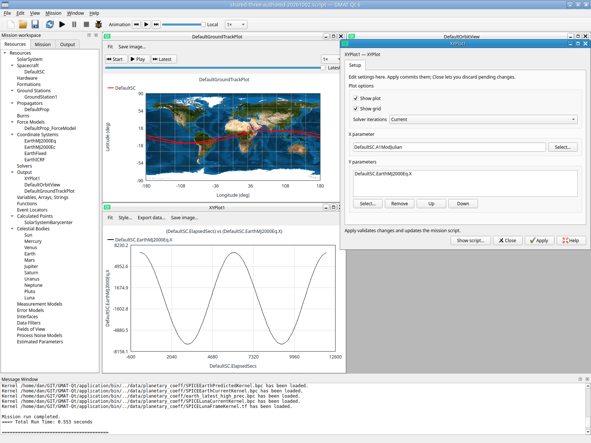
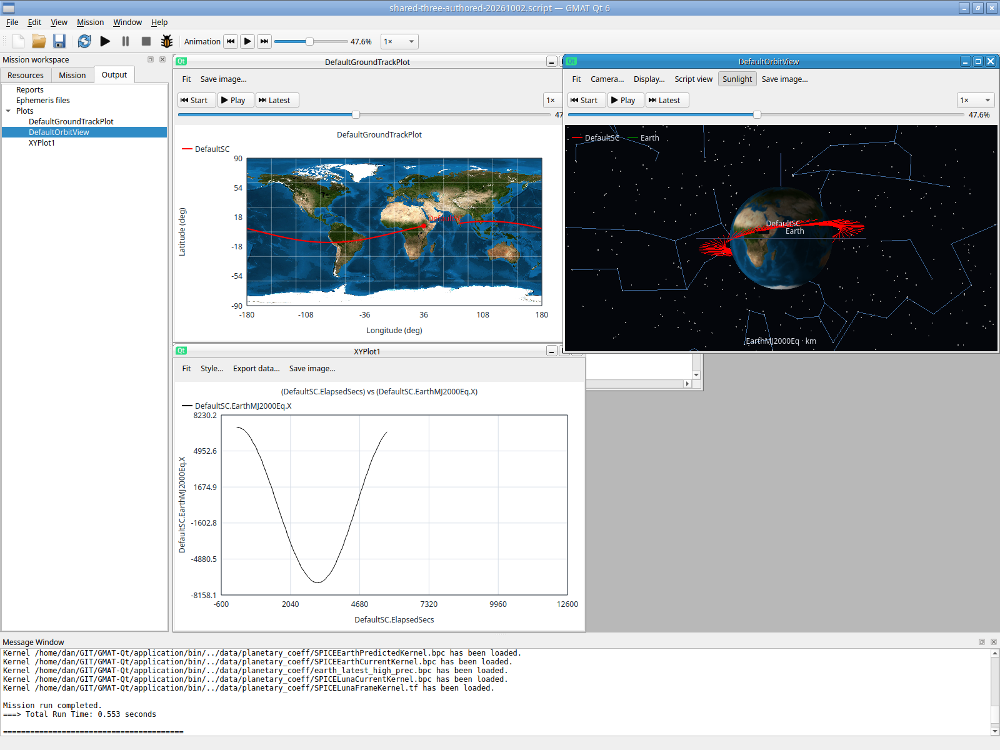

# Reachable retained settings windows — 2026-10-02

## Fix and focused evidence

Actual private X11 Window activation of a retained XYPlot settings panel clipped
its right controls. A new focused check also exposed a genuine initial placement
defect: Qt inherited the script's maximized state, then restored the new panel's
old unclamped normal geometry. Its minimum size fit the viewport. First diagnostics
show viewport 1004×651 and child (594,0)/680×571; the right edge was outside.
A single queued callback alone still ran before the later restoration and failed.
Those initial/diagnostic/trace/first-queued attempts remain preserved.

New configuration panels now normalize their inherited maximized state after
show, settle their own layouts, resize/move within the workspace and perform a
guarded final placement check after initialization. Explicit Window/Resources
activation also bounds the selected retained normal configuration panel. Later
explicit minimum/maximum states are respected; other windows and viewer
placement are not rearranged. The implementation pumps no global event loop.

QtGui.WorkspaceReachability passes **0.34 seconds**. The unchanged initial
full-bounds assertion now passes. Actual unified XY creation and one 60-second
mission retain the same settings owner; a pending parameter survives late layout
minimum growth, forced outside positioning and minimize/restore through both
activation routes. Close remains reachable. Source bytes, real report bytes,
other-window geometry and ordinary viewer activation placement remain unchanged.
Only this new focused check was rebuilt/retried; no old passing suite repeated.

## Actual-input retry

The rebuilt application loads the independently GUI-authored three-display
fixture, opens XY settings before F5, then completes **0.553 seconds**. The same
retained settings panel activated through Window is fully within the 1600×1200
workspace. Actual input changes its X parameter to DefaultSC.A1ModJulian without
Apply and drags the panel beyond the right edge. Window activation restores full
controls and the same pending field (005→006). Another drag and Resources
doubleclick likewise retain the edit and restore controls (007→008). Actual Close
opens the pending discard guard; confirmed Discard preserves visible displays.

A subsequent confirmed master Start shows 0% in Orbit/Ground and only the first XY
sample. An actual thumb drag seeks 47.6%; native velocity segments show the retained
historical samples. Deleting Orbit's widget and using the actual Output tree to
reopen retains its 47.6% readout, velocity, textured Earth and trajectory. Ground/XY
remain at the same shared position.

Captures 010/011 still contained the discard dialog after a wrong-coordinate
button attempt. They do not establish their intended master actions. Fresh 012
confirms dismissal; 013–016 establish accepted Start/seek/reopen. This corrects
the earlier inconclusive native velocity-middle attempt without inferring a
playback defect. Apply/build intentionally clears shared ownership; existing
shared positions are preserved by viewer reopening.

## Runtime identity and limits

- Application/bin/GmatQt SHA256:
  `c15cb5c18930019978bb8c335ec374258c67a2e24857ca7d455975808fb432a3`.
- Shared core SHA256:
  `5eb86098fbc52890a95d3226c56a4edd8e090308a940bb097749e23237532ab9`.
- Selected startup SHA256:
  `5f80be1f2dbe46faeb6d226328cace194d7770d086d5447c8b44928fb858559a`;
  private clone changes only OUTPUT_PATH, SHA256
  `9af76e621e2a755242fa1fe3060bc7fcc63065293e2166907d4b7518f065fca7`.
- Authored source remains byte-identical SHA256:
  `2d30468533a50b6495871e381803045d687fc0429b504b4d6739f2b8cd37e8a4`.

Full actual session/actions/captures/settings/output/assessment are preserved in
`build/example-qualification/20261002/isolated-x11/workspace-fixed`. All first
failures and final build/check logs are retained in the sibling focused-checks
tree. The owned helper exits 0 after requested cleanup; application SIGTERM(-15)
is the helper's documented shutdown, not an observed application crash.
Host GNOME Shell remains PID399961/start 2026-10-01 11:34:56 MDT. This qualifies the
bounded private X11/software GL behavior and separate offscreen invariants.
Host GNOME/Wayland, portals, hardware and full replacement remain open.
No Help tutorial construction is claimed; all walkthroughs remain Pending.
